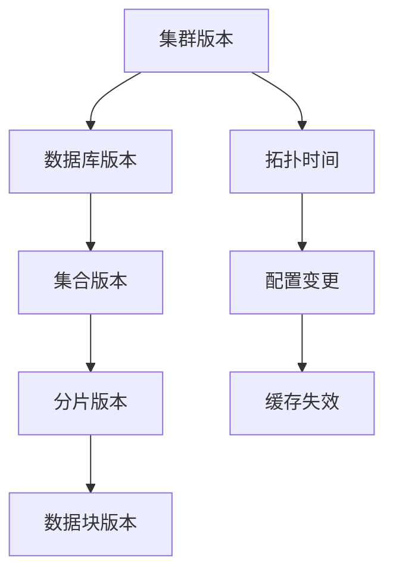

# 配置服务器模块深度分析

## 概述

配置服务器是 MongoDB 分片集群的元数据管理中心，负责存储和管理集群的所有配置信息，包括分片信息、数据库配置、集合分片策略、数据块分布等。本文档深入分析配置服务器模块的架构设计和实现细节。

## 架构设计思路

### 核心设计原则

1. **高可用性**：采用复制集架构，确保配置信息的高可用
2. **事务支持**：使用事务保证元数据操作的原子性和一致性
3. **版本控制**：通过版本号机制确保配置变更的有序性
4. **集中管理**：统一管理所有分片集群的元数据信息

### 模块组织结构

```
src/mongo/db/s/
├── config/
│   ├── sharding_catalog_manager.cpp          # 分片目录管理器
│   ├── sharding_catalog_manager_database_operations.cpp  # 数据库操作
│   └── sharding_catalog_manager_chunk_operations.cpp     # 数据块操作
├── sharding_initialization_mongod.cpp        # 分片初始化
└── sharding_state.cpp                        # 分片状态管理
```

## 核心组件实现

### 1. 分片目录管理器 (ShardingCatalogManager)

**源码位置**: `src/mongo/db/s/config/sharding_catalog_manager.cpp`

分片目录管理器是配置服务器的核心组件，负责管理所有分片集群的元数据操作。

<augment_code_snippet path="src/mongo/db/s/config/sharding_catalog_manager.cpp" mode="EXCERPT">
````cpp
void ShardingCatalogManager::create(ServiceContext* serviceContext,
                                    std::shared_ptr<executor::TaskExecutor> addShardExecutor,
                                    std::shared_ptr<Shard> localConfigShard,
                                    std::unique_ptr<ShardingCatalogClient> localCatalogClient) {
    invariant(serverGlobalParams.clusterRole.has(ClusterRole::ConfigServer));
    
    auto& shardingCatalogManager = getShardingCatalogManager(serviceContext);
    invariant(!shardingCatalogManager);
    
    shardingCatalogManager.emplace(serviceContext,
                                   std::move(addShardExecutor),
                                   std::move(localConfigShard),
                                   std::move(localCatalogClient));
}
````
</augment_code_snippet>

**核心功能**：
- **分片管理**: 添加、删除、更新分片信息
- **数据库管理**: 创建、删除数据库配置
- **集合管理**: 分片集合的配置和管理
- **数据块管理**: 数据块的分割、合并、迁移

### 2. 分片初始化 (ShardingInitializationMongoD)

**源码位置**: `src/mongo/db/s/sharding_initialization_mongod.cpp`

负责 mongod 实例的分片功能初始化，包括配置服务器和分片服务器的初始化。

<augment_code_snippet path="src/mongo/db/s/sharding_initialization_mongod.cpp" mode="EXCERPT">
````cpp
void ShardingInitializationMongoD::onConsistentDataAvailable(OperationContext* opCtx,
                                                             bool isMajority,
                                                             bool isRollback) {
    if (isRollback) {
        return;
    }
    
    if (serverGlobalParams.clusterRole.has(ClusterRole::ConfigServer)) {
        initializeGlobalShardingStateForConfigServer(opCtx);
    }
    
    if (auto shardIdentityDoc = getShardIdentityDoc(opCtx)) {
        initializeShardingAwarenessAndLoadGlobalSettings(opCtx, *shardIdentityDoc);
    }
}
````
</augment_code_snippet>

**初始化流程**：
- **角色识别**: 判断当前节点是配置服务器还是分片服务器
- **状态初始化**: 初始化分片相关的全局状态
- **服务启动**: 启动分片相关的后台服务

### 3. 数据库操作管理

**源码位置**: `src/mongo/db/s/config/sharding_catalog_manager_database_operations.cpp`

管理数据库级别的分片操作，包括数据库的创建、删除和配置更新。

<augment_code_snippet path="src/mongo/db/s/config/sharding_catalog_manager_database_operations.cpp" mode="EXCERPT">
````cpp
DatabaseType ShardingCatalogManager::createDatabase(
    OperationContext* opCtx,
    const DatabaseName& dbName,
    const boost::optional<ShardId>& optResolvedPrimaryShard,
    const SerializationContext& serializationContext) {
    
    // 强制更新过期的元数据
    ON_BLOCK_EXIT([&] { RoutingInformationCache::get(opCtx)->purgeDatabase(dbName); });
    
    const auto dbNameStr = DatabaseNameUtil::serialize(dbName, serializationContext);
    const auto dbMatchFilterExact =
        create_database_util::constructDbMatchFilterExact(dbNameStr, optResolvedPrimaryShard);
    
    // 使用事务确保操作的原子性
    auto& replClient = repl::ReplClientInfo::forClient(opCtx->getClient());
    DBDirectClient client(opCtx);
    // ... 数据库创建逻辑
}
````
</augment_code_snippet>

**操作特性**：
- **事务保证**: 使用事务确保数据库操作的原子性
- **缓存管理**: 自动清理相关的缓存信息
- **版本控制**: 维护数据库版本信息

## 配置数据库结构

配置服务器使用专门的 `config` 数据库存储元数据：

### 核心集合

1. **config.shards**: 存储分片信息
   ```javascript
   {
     _id: "shard0001",
     host: "shard0001/host1:27018,host2:27018,host3:27018",
     state: 1,
     topologyTime: Timestamp(...)
   }
   ```

2. **config.databases**: 存储数据库配置
   ```javascript
   {
     _id: "myapp",
     primary: "shard0001",
     version: {
       uuid: UUID("..."),
       timestamp: Timestamp(...),
       lastMod: 1
     }
   }
   ```

3. **config.collections**: 存储集合分片配置
   ```javascript
   {
     _id: "myapp.users",
     key: { userId: 1 },
     unique: false,
     uuid: UUID("..."),
     timestamp: Timestamp(...)
   }
   ```

4. **config.chunks**: 存储数据块信息
   ```javascript
   {
     _id: ObjectId("..."),
     uuid: UUID("..."),
     min: { userId: 0 },
     max: { userId: 1000 },
     shard: "shard0001",
     history: [...]
   }
   ```

## 元数据管理机制

### 1. 版本控制系统

配置服务器使用多层版本控制确保一致性：



### 2. 事务处理

所有元数据变更都在事务中执行：

<augment_code_snippet path="src/mongo/db/s/config/sharding_catalog_manager_database_operations.cpp" mode="EXCERPT">
````cpp
const auto transactionChain = [db](const txn_api::TransactionClient& txnClient,
                                   ExecutorPtr txnExec) {
    write_ops::InsertCommandRequest insertDatabaseEntryOp(
        NamespaceString::kConfigDatabasesNamespace);
    insertDatabaseEntryOp.setDocuments({db.toBSON()});
    return txnClient.runCRUDOp(insertDatabaseEntryOp, {})
        .thenRunOn(txnExec)
        .then([&txnClient, &txnExec, &db](
                  const BatchedCommandResponse& insertDatabaseEntryResponse) {
            uassertStatusOK(insertDatabaseEntryResponse.toStatus());
            // ... 后续事务操作
        });
};
````
</augment_code_snippet>

### 3. 缓存同步机制

配置变更后自动触发缓存更新：

- **主动失效**: 配置变更时主动清理相关缓存
- **版本检查**: 通过版本号检测缓存是否过期
- **增量更新**: 支持增量更新减少网络开销

## 高可用性设计

### 1. 复制集架构

配置服务器必须部署为复制集：

- **主节点**: 处理所有写操作
- **从节点**: 提供读操作和故障转移
- **仲裁节点**: 参与选举但不存储数据

### 2. 故障处理

<augment_code_snippet path="src/mongo/db/s/sharding_initialization_mongod.cpp" mode="EXCERPT">
````cpp
void ShardingInitializationMongoD::onStepUpBegin(OperationContext* opCtx, long long term) {
    _isPrimary.store(true);
    if (Grid::get(opCtx)->isInitialized()) {
        auto executor = Grid::get(opCtx)->getExecutorPool()->getFixedExecutor();
        // 更新分片注册表中的连接字符串
        (void)ShardingReady::get(opCtx)->isReadyFuture().thenRunOn(executor).then([&]() {
            ShardRegistry::scheduleReplicaSetUpdateOnConfigServerIfNeeded(
                [&]() -> bool { return _isPrimary.load(); });
        });
    }
}
````
</augment_code_snippet>

### 3. 数据一致性

- **写关注**: 使用 majority 写关注确保数据持久性
- **读关注**: 支持不同级别的读关注
- **因果一致性**: 通过逻辑时钟保证因果一致性

## 性能优化策略

### 1. 索引优化

为配置集合创建合适的索引：

```javascript
// config.chunks 集合索引
db.chunks.createIndex({ uuid: 1, min: 1 })
db.chunks.createIndex({ uuid: 1, shard: 1, min: 1 })
db.chunks.createIndex({ uuid: 1, lastmod: 1 })

// config.collections 集合索引
db.collections.createIndex({ _id: 1 })
db.collections.createIndex({ lastmodEpoch: 1, lastmod: 1 })
```

### 2. 批量操作

支持批量更新减少网络往返：

- **批量插入**: 一次插入多个数据块
- **批量更新**: 批量更新数据块版本
- **事务批处理**: 在单个事务中处理多个操作

### 3. 连接池管理

- **连接复用**: 复用到分片的连接
- **连接监控**: 监控连接健康状态
- **自动重连**: 连接断开时自动重连

## 总结

配置服务器模块通过精心设计的架构实现了 MongoDB 分片集群的元数据管理功能。其复制集架构保证了高可用性，事务机制确保了数据一致性，而版本控制系统则保证了配置变更的有序性。通过深入理解这些设计思路和实现细节，可以更好地管理和优化 MongoDB 分片集群的配置服务器。
