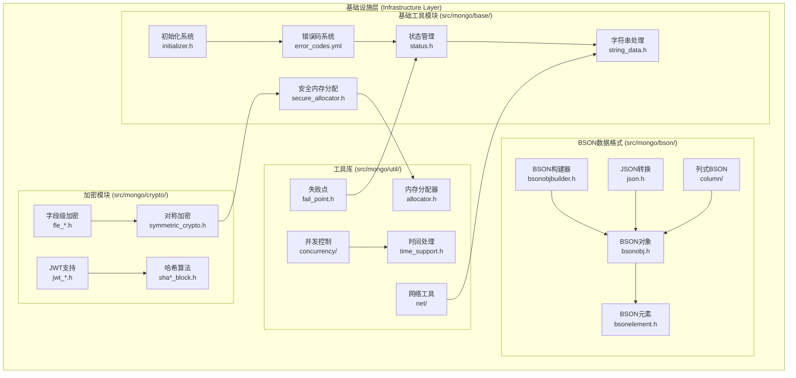
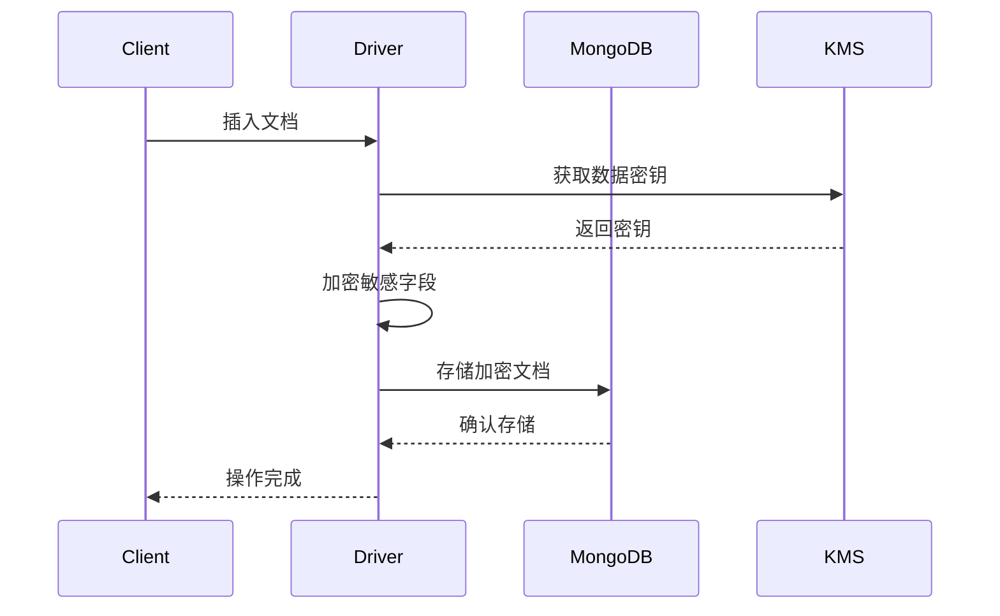
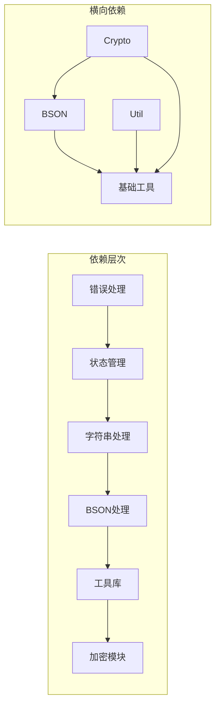

# MongoDB 基础设施层深度分析

## 概述

基础设施层是MongoDB的最底层，为整个系统提供基础的数据结构、工具类、错误处理、内存管理等核心功能。这一层的设计直接影响到整个系统的性能、稳定性和可维护性。

## 核心模块架构



## 1. 基础工具模块 (src/mongo/base/)

### 1.1 错误处理系统

#### 错误码定义 (`src/mongo/base/error_codes.yml`)
MongoDB使用统一的错误码系统来处理各种错误情况：

**核心特性**:
- 集中式错误码定义
- 自动生成C++头文件
- 支持错误码分类和层次结构
- 国际化错误消息支持

**关键组件**:
```cpp
// 自动生成的错误码枚举
enum class ErrorCodes::Error {
    OK = 0,
    InternalError = 1,
    BadValue = 2,
    NoSuchKey = 4,
    // ... 更多错误码
};
```

#### 状态管理 (`src/mongo/base/status.h`)
Status类是MongoDB中处理错误和状态的核心类：

**核心功能**:
- 封装操作结果和错误信息
- 支持错误码和详细错误消息
- 提供链式错误处理
- 零开销的成功状态表示

**使用示例**:
```cpp
Status processDocument(const BSONObj& doc) {
    if (doc.isEmpty()) {
        return Status(ErrorCodes::BadValue, "Document cannot be empty");
    }
    // 处理文档...
    return Status::OK();
}
```

### 1.2 字符串处理 (`src/mongo/base/string_data.h`)

StringData是MongoDB中高效字符串处理的核心类：

**设计特点**:
- 非拥有性字符串视图
- 避免不必要的内存分配
- 支持常量时间的子串操作
- 与std::string兼容

**性能优势**:
```cpp
class StringData {
private:
    const char* _data;
    size_t _size;
public:
    // 零拷贝构造
    StringData(const char* str) : _data(str), _size(strlen(str)) {}
    StringData(const std::string& str) : _data(str.c_str()), _size(str.size()) {}
};
```

### 1.3 初始化系统 (`src/mongo/base/initializer.h`)

MongoDB使用依赖注入的初始化系统来管理模块启动顺序：

**核心概念**:
- 声明式依赖管理
- 自动依赖解析
- 分阶段初始化
- 错误处理和回滚

**使用模式**:
```cpp
MONGO_INITIALIZER(MyModule)(InitializerContext* context) {
    // 初始化代码
    return Status::OK();
}

MONGO_INITIALIZER_GENERAL(MyModuleWithDeps, 
                         ("NetworkInit"), // 依赖
                         ("StorageInit")) // 被依赖
(InitializerContext* context) {
    // 初始化代码
    return Status::OK();
}
```

### 1.4 安全内存分配 (`src/mongo/base/secure_allocator.h`)

为敏感数据提供安全的内存管理：

**安全特性**:
- 内存锁定防止交换到磁盘
- 自动零化释放的内存
- 防止编译器优化掉内存清零
- 支持不同安全域

**核心类型**:
```cpp
template<typename T>
using SecureVector = SecureAllocatorDefaultDomain::SecureVector<T>;
using SecureString = SecureAllocatorDefaultDomain::SecureString;

// 使用示例
SecureString password;
SecureVector<uint8_t> keyMaterial;
```

## 2. BSON数据格式模块 (src/mongo/bson/)

### 2.1 BSON对象 (`src/mongo/bson/bsonobj.h`)

BSONObj是MongoDB文档的C++表示：

**核心特性**:
- 智能指针语义
- 写时复制优化
- 内存高效的表示
- 支持嵌套文档和数组

**内存布局**:
```
BSON Document Layout:
[4字节长度][字段1][字段2]...[字段N][0x00结束符]

字段格式:
[1字节类型][字段名\0][值数据]
```

**关键方法**:
```cpp
class BSONObj {
public:
    // 字段访问
    BSONElement getField(StringData name) const;
    bool hasField(StringData name) const;
    
    // 迭代器支持
    BSONObjIterator begin() const;
    
    // 序列化
    int objsize() const;
    const char* objdata() const;
    
    // 比较操作
    int woCompare(const BSONObj& other) const;
};
```

### 2.2 BSON元素 (`src/mongo/bson/bsonelement.h`)

BSONElement表示BSON文档中的单个字段：

**类型系统**:
```cpp
enum BSONType {
    EOO = 0,
    NumberDouble = 1,
    String = 2,
    Object = 3,
    Array = 4,
    BinData = 5,
    ObjectId = 7,
    Bool = 8,
    Date = 9,
    jstNULL = 10,
    RegEx = 11,
    // ... 更多类型
};
```

**值访问**:
```cpp
class BSONElement {
public:
    // 类型检查
    BSONType type() const;
    bool isNumber() const;
    bool isSimpleType() const;
    
    // 值提取
    double numberDouble() const;
    std::string str() const;
    BSONObj embeddedObject() const;
    
    // 字段信息
    StringData fieldName() const;
    int size() const;
};
```

### 2.3 BSON构建器 (`src/mongo/bson/bsonobjbuilder.h`)

BSONObjBuilder用于高效构建BSON文档：

**构建模式**:
```cpp
BSONObjBuilder builder;
builder.append("name", "MongoDB");
builder.append("version", 7.0);
builder.append("features", BSON_ARRAY("sharding" << "replication"));

BSONObj doc = builder.obj();
```

**性能优化**:
- 预分配缓冲区
- 最小化内存重分配
- 支持嵌套构建器
- 延迟大小计算

### 2.4 列式BSON (`src/mongo/bson/column/`)

为时间序列和分析工作负载优化的列式存储格式：

**压缩特性**:
- Delta编码
- Run-length编码
- 简单8b压缩算法
- 交错列存储

**使用场景**:
```cpp
BSONColumnBuilder builder;
builder.append(BSON("timestamp" << Date_t::now() << "value" << 42));
builder.append(BSON("timestamp" << Date_t::now() << "value" << 43));

BSONBinData compressed = builder.finalize();
```

## 3. 工具库模块 (src/mongo/util/)

### 3.1 并发控制 (`src/mongo/util/concurrency/`)

提供线程安全的并发原语：

**核心组件**:
- **Mutex**: 基础互斥锁
- **ReadWriteMutex**: 读写锁
- **ThreadPool**: 线程池
- **Future/Promise**: 异步编程支持

### 3.2 时间处理 (`src/mongo/util/time_support.h`)

统一的时间处理接口：

**时间类型**:
```cpp
using Date_t = std::chrono::time_point<std::chrono::system_clock, Milliseconds>;
using Milliseconds = std::chrono::milliseconds;
using Seconds = std::chrono::seconds;
```

### 3.3 失败点 (`src/mongo/util/fail_point.h`)

测试和调试工具，允许在运行时注入故障：

**使用模式**:
```cpp
MONGO_FAIL_POINT_DEFINE(hangAfterCollectionInserts);

void insertDocument() {
    // 正常插入逻辑
    insertToCollection();
    
    // 测试注入点
    hangAfterCollectionInserts.pauseWhileSet();
}
```

## 4. 加密模块 (src/mongo/crypto/)

### 4.1 字段级加密 (`src/mongo/crypto/fle_*.h`)

客户端字段级加密(FLE)的实现：

**加密流程**:


### 4.2 JWT支持 (`src/mongo/crypto/jwt_*.h`)

JSON Web Token的验证和处理：

**验证流程**:
- JWT签名验证
- 声明验证
- 过期时间检查
- 发行者验证

## 模块间依赖关系



## 性能考虑

### 1. 内存管理
- 使用对象池减少分配开销
- 智能指针管理生命周期
- 安全分配器保护敏感数据

### 2. 字符串优化
- StringData避免不必要拷贝
- 小字符串优化(SSO)
- 内存映射大字符串

### 3. BSON优化
- 零拷贝解析
- 延迟字段访问
- 压缩存储格式

## 最佳实践

### 1. 错误处理
```cpp
// 好的做法
StatusWith<BSONObj> parseDocument(StringData input) {
    if (input.empty()) {
        return Status(ErrorCodes::BadValue, "Empty input");
    }
    // 解析逻辑...
    return document;
}

// 使用
auto result = parseDocument(input);
if (!result.isOK()) {
    return result.getStatus();
}
BSONObj doc = result.getValue();
```

### 2. 内存安全
```cpp
// 敏感数据使用安全分配器
SecureString password = getPassword();
SecureVector<uint8_t> keyMaterial = deriveKey(password);

// 自动清零，防止内存泄露
```

### 3. 性能优化
```cpp
// 使用StringData避免拷贝
void processField(StringData fieldName) {
    // 直接使用，无需拷贝
}

// 预分配BSON构建器
BSONObjBuilder builder(1024); // 预分配1KB
```

基础设施层为MongoDB提供了坚实的基础，其设计直接影响到整个系统的性能和可靠性。理解这一层的设计原理对于MongoDB的开发和优化至关重要。
