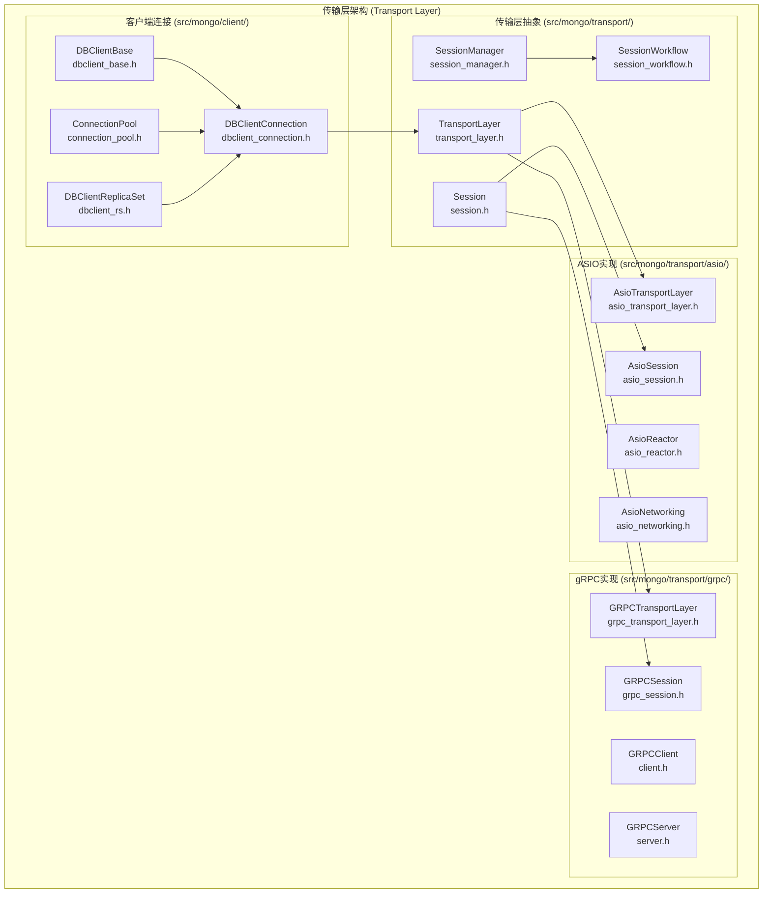
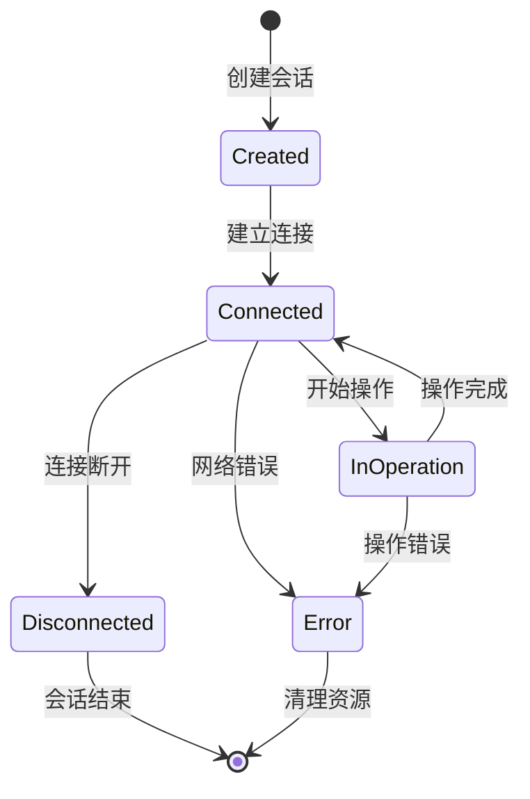
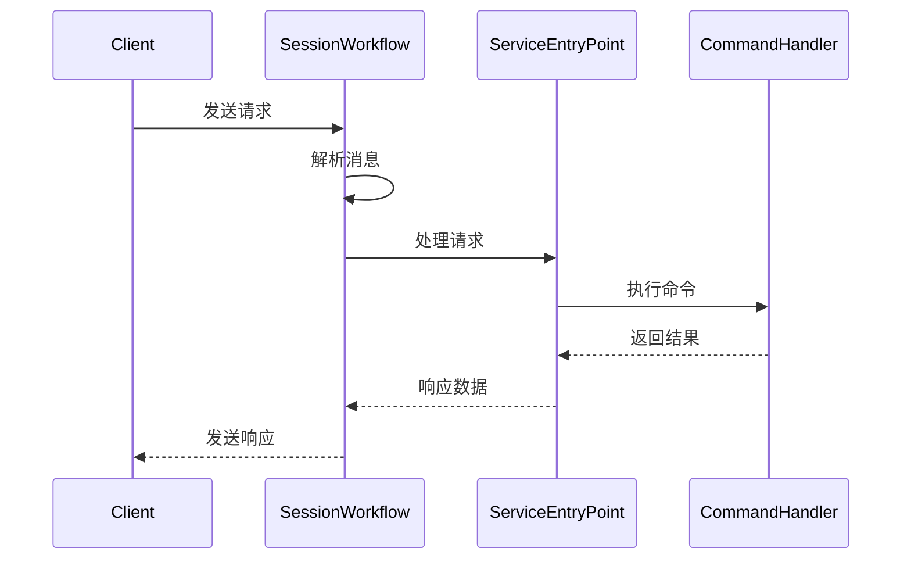
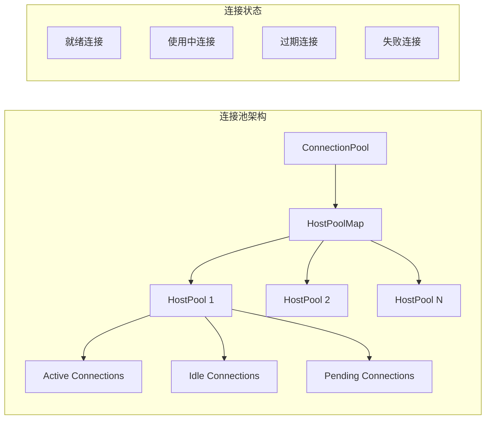
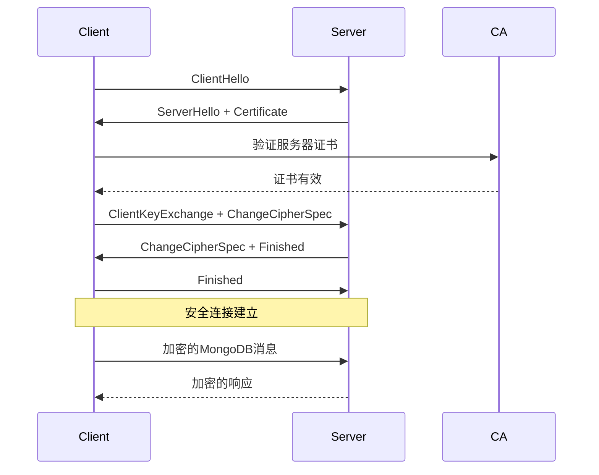

# MongoDB 传输层深度分析

## 概述

传输层是MongoDB网络通信的核心，负责处理客户端连接、会话管理、网络IO和协议处理。这一层为上层应用提供了统一的网络抽象，支持多种传输协议和连接模式。

## 核心架构



## 1. 传输层抽象 (src/mongo/transport/)

### 1.1 TransportLayer接口 (`src/mongo/transport/transport_layer.h`)

TransportLayer是所有传输实现的基类，定义了统一的网络接口：

**核心接口**:
```cpp
class TransportLayer {
public:
    // 同步连接
    virtual StatusWith<std::shared_ptr<Session>> connect(
        HostAndPort peer,
        ConnectSSLMode sslMode,
        Milliseconds timeout,
        const boost::optional<TransientSSLParams>& transientSSLParams = boost::none) = 0;
    
    // 异步连接
    virtual Future<std::shared_ptr<Session>> asyncConnect(
        HostAndPort peer,
        ConnectSSLMode sslMode,
        const ReactorHandle& reactor,
        Milliseconds timeout,
        std::shared_ptr<ConnectionMetrics> connectionMetrics,
        std::shared_ptr<const SSLConnectionContext> transientSSLContext) = 0;
    
    // 启动和关闭
    virtual Status setup() = 0;
    virtual Status start() = 0;
    virtual void shutdown() = 0;
};
```

**设计特点**:
- 协议无关的抽象接口
- 支持同步和异步连接模式
- SSL/TLS集成
- 连接池和会话管理

### 1.2 Session会话管理 (`src/mongo/transport/session.h`)

Session表示一个客户端连接的生命周期：

**核心功能**:
```cpp
class Session {
public:
    using Id = uint64_t;
    
    // 会话标识
    Id id() const { return _id; }
    
    // 网络操作
    virtual Future<Message> asyncSourceMessage() = 0;
    virtual Future<void> asyncSinkMessage(Message message) = 0;
    
    // 会话状态
    virtual void end() = 0;
    virtual bool isConnected() = 0;
    
    // 操作状态管理
    void setInOperation(bool state);
    
protected:
    const Id _id;
    std::atomic<bool> _inOperation{false};
    std::weak_ptr<SessionManager> _sessionManager;
};
```

**生命周期管理**:


### 1.3 SessionManager会话管理器 (`src/mongo/transport/session_manager.h`)

SessionManager负责管理所有活跃的会话：

**核心职责**:
- 会话生命周期管理
- 连接数限制
- 会话统计和监控
- 优雅关闭处理

**实现细节**:
```cpp
class SessionManagerCommon : public SessionManager {
private:
    struct SessionInfo {
        std::shared_ptr<SessionWorkflow> workflow;
        ClientSummary summary;
    };
    
    using ByClientMap = stdx::unordered_map<Client*, SessionInfo>;
    
    struct Sessions {
        mutable stdx::mutex _mutex;
        stdx::condition_variable _cv;
        Atomic<std::size_t> _size{0};
        Atomic<std::size_t> _created{0};
        Atomic<std::size_t> _rejected{0};
        ByClientMap _byClient;
    };
    
public:
    void startSession(std::shared_ptr<Session> session) override;
    void endSessionByClient(Client* client) override;
};
```

### 1.4 SessionWorkflow工作流 (`src/mongo/transport/session_workflow.h`)

SessionWorkflow处理单个会话的请求-响应循环：

**工作流程**:


## 2. ASIO传输实现 (src/mongo/transport/asio/)

### 2.1 AsioTransportLayer (`src/mongo/transport/asio/asio_transport_layer.h`)

基于Boost.Asio的高性能异步网络实现：

**核心特性**:
- 异步IO操作
- 多线程Reactor模式
- SSL/TLS支持
- IPv4/IPv6双栈支持

**连接建立流程**:
```cpp
StatusWith<std::shared_ptr<Session>> AsioTransportLayer::connect(
    HostAndPort peer,
    ConnectSSLMode sslMode,
    Milliseconds timeout,
    const boost::optional<TransientSSLParams>& transientSSLParams) {
    
    // DNS解析
    WrappedResolver resolver(*_egressReactor);
    auto swEndpoints = resolver.resolve(peer, _listenerOptions.enableIPv6);
    
    // 建立连接
    auto sws = _doSyncConnect(endpoints.front(), peer, timeout, transientSSLParams);
    
    // 创建会话
    auto session = std::move(sws.getValue());
    session->ensureSync();
    return session;
}
```

### 2.2 AsioSession (`src/mongo/transport/asio/asio_session.h`)

ASIO会话实现，处理具体的网络IO：

**消息处理**:
```cpp
class AsioSession : public Session {
public:
    Future<Message> asyncSourceMessage() override {
        return _asyncSourceMessage().then([this](Message m) {
            networkCounter.hitPhysicalIn(m.size());
            return m;
        });
    }
    
    Future<void> asyncSinkMessage(Message message) override {
        networkCounter.hitPhysicalOut(message.size());
        return _asyncSinkMessage(std::move(message));
    }
    
private:
    Future<Message> _asyncSourceMessage();
    Future<void> _asyncSinkMessage(Message message);
};
```

### 2.3 AsioReactor事件循环 (`src/mongo/transport/asio/asio_reactor.h`)

Reactor模式的事件循环实现：

**事件处理**:
```cpp
class AsioReactor : public Reactor {
public:
    void run() override {
        _ioContext.run();
    }
    
    void runFor(Milliseconds time) override {
        _ioContext.run_for(time.toSystemDuration());
    }
    
    void stop() override {
        _ioContext.stop();
    }
    
private:
    asio::io_context _ioContext;
    std::vector<std::thread> _threads;
};
```

## 3. gRPC传输实现 (src/mongo/transport/grpc/)

### 3.1 GRPCTransportLayer (`src/mongo/transport/grpc/grpc_transport_layer.h`)

基于gRPC的现代RPC传输实现：

**设计目标**:
- 现代RPC协议支持
- HTTP/2多路复用
- 流式数据传输
- 跨语言互操作性

**服务注册**:
```cpp
class GRPCTransportLayerImpl : public GRPCTransportLayer {
public:
    void registerService(std::unique_ptr<grpc::Service> service) override {
        invariant(!_server, "Cannot register services after calling setup()");
        _services.push_back(std::move(service));
    }
    
    StatusWith<std::shared_ptr<Session>> connectWithAuthToken(
        HostAndPort peer,
        ConnectSSLMode sslMode,
        Milliseconds timeout,
        boost::optional<std::string> authToken) override;
};
```

### 3.2 gRPC客户端 (`src/mongo/transport/grpc/client.h`)

gRPC客户端连接管理：

**连接建立**:
```cpp
class Client {
public:
    Future<std::shared_ptr<EgressSession>> connect(
        const HostAndPort& remote,
        const std::shared_ptr<GRPCReactor>& reactor,
        Milliseconds timeout,
        ConnectOptions options,
        const CancellationToken& token = CancellationToken::uncancelable(),
        std::shared_ptr<ConnectionMetrics> connectionMetrics = nullptr);
        
    struct ConnectOptions {
        boost::optional<std::string> authToken = {};
        ConnectSSLMode sslMode = ConnectSSLMode::kGlobalSSLMode;
    };
};
```

## 4. 客户端连接层 (src/mongo/client/)

### 4.1 DBClientBase (`src/mongo/client/dbclient_base.h`)

数据库客户端的基类，提供统一的数据库操作接口：

**核心操作**:
```cpp
class DBClientBase {
public:
    // 查询操作
    virtual std::unique_ptr<DBClientCursor> query(
        const NamespaceStringOrUUID& nsOrUuid,
        const BSONObj& query,
        int nToReturn = 0,
        int nToSkip = 0,
        const BSONObj* fieldsToReturn = nullptr,
        int queryOptions = 0,
        int batchSize = 0) = 0;
    
    // 插入操作
    virtual void insert(const std::string& ns, 
                       const BSONObj& obj, 
                       int flags = 0) = 0;
    
    // 更新操作
    virtual void update(const std::string& ns,
                       const BSONObj& query,
                       const BSONObj& obj,
                       bool upsert = false,
                       bool multi = false) = 0;
};
```

### 4.2 DBClientConnection (`src/mongo/client/dbclient_connection.h`)

单个数据库连接的实现：

**连接管理**:
```cpp
class DBClientConnection : public DBClientSession {
public:
    DBClientConnection(bool autoReconnect = false,
                      double soTimeout = 0,
                      MongoURI uri = {},
                      const HandshakeValidationHook& hook = {},
                      const ClientAPIVersionParameters* apiParameters = nullptr);
    
protected:
    StatusWith<std::shared_ptr<transport::Session>> _makeSession(
        const HostAndPort& host,
        transport::ConnectSSLMode sslMode,
        Milliseconds timeout,
        const boost::optional<TransientSSLParams>& transientSSLParams) override;
        
    void _reconnectSession() override;
    
private:
    BackoffRepeater _autoReconnectBackoff;
};
```

### 4.3 连接池 (`src/mongo/client/connection_pool.h`)

连接池管理多个数据库连接：

**池化策略**:


## 5. 网络协议处理

### 5.1 消息格式

MongoDB使用自定义的二进制协议进行通信：

**消息结构**:
```
MongoDB Wire Protocol Message:
+------------------+
| Message Header   | 16 bytes
+------------------+
| Message Body     | Variable length
+------------------+

Message Header:
+------------------+
| messageLength    | 4 bytes (int32)
| requestID        | 4 bytes (int32)
| responseTo       | 4 bytes (int32)
| opCode           | 4 bytes (int32)
+------------------+
```

### 5.2 操作码类型

```cpp
enum class OpCode : int32_t {
    OP_REPLY = 1,        // 回复消息
    OP_UPDATE = 2001,    // 更新操作
    OP_INSERT = 2002,    // 插入操作
    OP_QUERY = 2004,     // 查询操作
    OP_GET_MORE = 2005,  // 获取更多结果
    OP_DELETE = 2006,    // 删除操作
    OP_KILL_CURSORS = 2007, // 关闭游标
    OP_COMPRESSED = 2012,   // 压缩消息
    OP_MSG = 2013,          // 通用消息(MongoDB 3.6+)
};
```

## 6. SSL/TLS安全传输

### 6.1 SSL配置

```cpp
struct SSLParams {
    enum class Protocols { TLS1_0, TLS1_1, TLS1_2, TLS1_3 };
    
    std::string sslPEMKeyFile;
    std::string sslPEMKeyPassword;
    std::string sslCAFile;
    std::string sslCRLFile;
    std::vector<Protocols> sslDisabledProtocols;
    bool sslWeakCertificateValidation = false;
    bool sslAllowInvalidHostnames = false;
    bool sslAllowInvalidCertificates = false;
};
```

### 6.2 SSL握手流程



## 7. 性能优化

### 7.1 连接复用

```cpp
class ConnectionPool {
private:
    struct PoolOptions {
        size_t maxConnections = 100;
        Milliseconds maxConnectionIdleTime = Minutes(30);
        Milliseconds connectionTimeout = Seconds(30);
        size_t minConnections = 1;
    };
    
public:
    Future<ConnectionHandle> get(const HostAndPort& hostAndPort,
                                transport::ConnectSSLMode sslMode,
                                Milliseconds timeout);
};
```

### 7.2 异步IO优化

```cpp
// 批量消息处理
class AsioSession {
private:
    Future<void> _asyncSinkMessage(Message message) {
        return _sinkBuffer.push(std::move(message))
            .then([this] { return _flushSinkBuffer(); });
    }
    
    Future<void> _flushSinkBuffer() {
        // 批量发送缓冲区中的消息
        return asio::async_write(_socket, _sinkBuffer.data(), asio::use_future);
    }
};
```

## 8. 监控和诊断

### 8.1 连接指标

```cpp
struct ConnectionMetrics {
    AtomicWord<long long> totalCreated{0};
    AtomicWord<long long> totalDestroyed{0};
    AtomicWord<long long> totalInUse{0};
    AtomicWord<long long> totalAvailable{0};
    AtomicWord<long long> totalRefreshing{0};
    AtomicWord<long long> totalRefreshed{0};
};
```

### 8.2 网络统计

```cpp
class NetworkCounter {
public:
    void hitPhysicalIn(long long bytes) { _physicalBytesIn.fetchAndAdd(bytes); }
    void hitPhysicalOut(long long bytes) { _physicalBytesOut.fetchAndAdd(bytes); }
    void hitLogicalIn(long long bytes) { _logicalBytesIn.fetchAndAdd(bytes); }
    void hitLogicalOut(long long bytes) { _logicalBytesOut.fetchAndAdd(bytes); }
    
private:
    AtomicWord<long long> _physicalBytesIn{0};
    AtomicWord<long long> _physicalBytesOut{0};
    AtomicWord<long long> _logicalBytesIn{0};
    AtomicWord<long long> _logicalBytesOut{0};
};
```

传输层为MongoDB提供了高性能、可扩展的网络通信基础，支持多种传输协议和连接模式，是整个系统稳定运行的关键组件。
