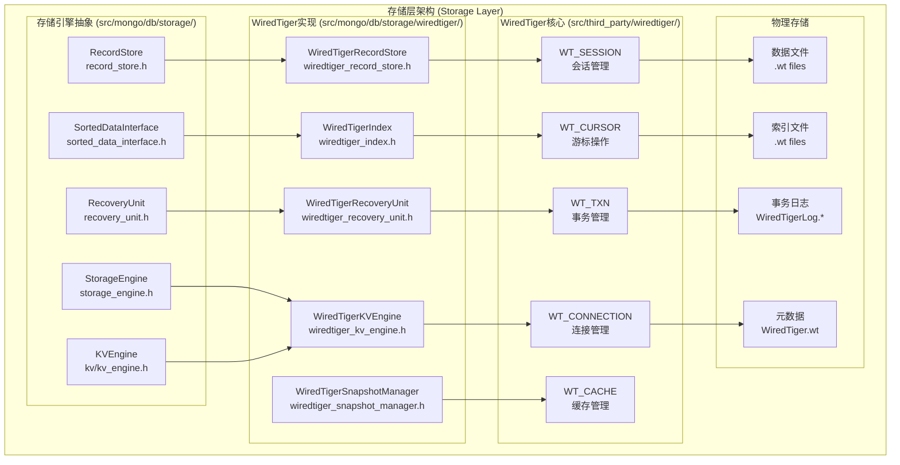
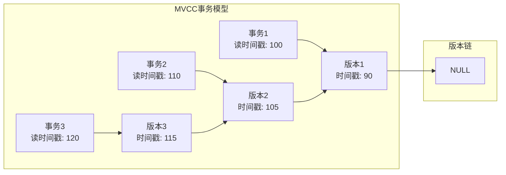
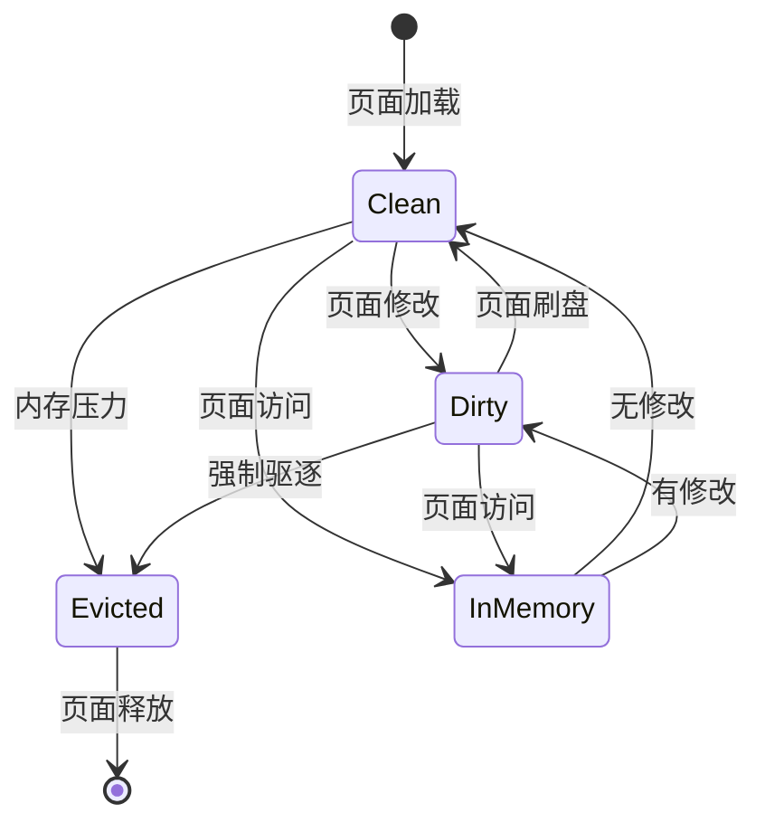
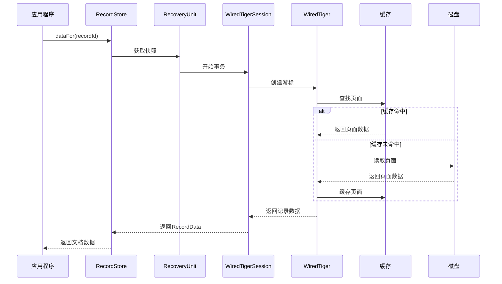
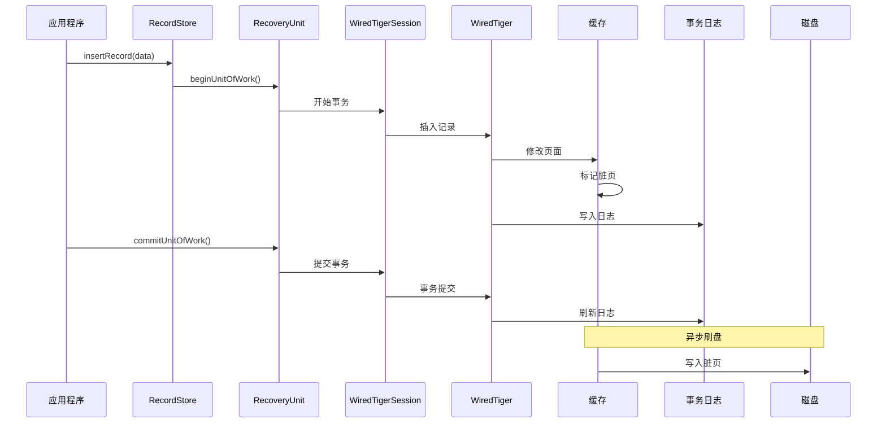
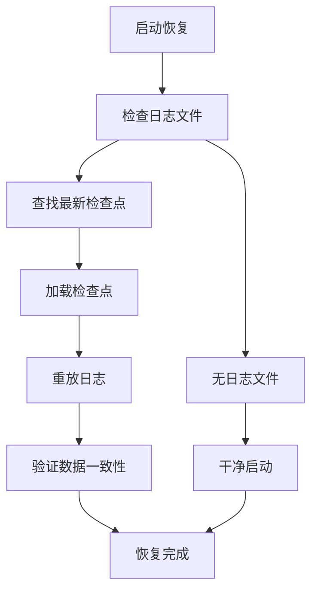

# MongoDB 存储层深度分析

## 概述

存储层是MongoDB数据持久化的核心，负责数据的存储、检索、事务管理和恢复。MongoDB采用可插拔的存储引擎架构，默认使用WiredTiger存储引擎，提供高性能的文档级并发控制和MVCC支持。

## 核心架构



## 1. 存储引擎抽象层 (src/mongo/db/storage/)

### 1.1 StorageEngine接口 (`src/mongo/db/storage/storage_engine.h`)

StorageEngine是所有存储引擎实现的基类：

**核心接口**:
```cpp
class StorageEngine {
public:
    // 恢复单元管理
    virtual std::unique_ptr<RecoveryUnit> newRecoveryUnit() = 0;
    
    // 记录存储管理
    virtual Status createRecordStore(const NamespaceString& ns,
                                   StringData ident,
                                   const RecordStore::Options& options) = 0;
    
    virtual std::unique_ptr<RecordStore> getRecordStore(
        const NamespaceString& ns,
        StringData ident,
        const RecordStore::Options& options) = 0;
    
    // 索引管理
    virtual Status createSortedDataInterface(const NamespaceString& ns,
                                           const IndexDescriptor* desc,
                                           StringData ident) = 0;
    
    virtual std::unique_ptr<SortedDataInterface> getSortedDataInterface(
        const NamespaceString& ns,
        const IndexDescriptor* desc,
        StringData ident) = 0;
    
    // 检查点和恢复
    virtual bool supportsCheckpoints() const = 0;
    virtual bool hasDataBeenCheckpointed(CheckpointIteration iteration) const = 0;
    
    // 缓存管理
    virtual bool underCachePressure(int concurrentWriteOuts, int concurrentReadOuts) = 0;
    virtual size_t getCacheSizeMB() = 0;
};
```

**工厂模式**:
```cpp
class StorageEngine::Factory {
public:
    virtual std::unique_ptr<StorageEngine> create(
        OperationContext* opCtx,
        const StorageGlobalParams& params,
        const StorageEngineLockFile* lockFile,
        bool isReplSet,
        bool shouldRecoverFromOplogAsStandalone,
        bool inStandaloneMode) const = 0;
};
```

### 1.2 RecordStore记录存储 (`src/mongo/db/storage/record_store.h`)

RecordStore提供文档存储的抽象接口：

**核心操作**:
```cpp
class RecordStore {
public:
    // 记录操作
    virtual StatusWith<RecordId> insertRecord(OperationContext* opCtx,
                                             const char* data,
                                             int len,
                                             Timestamp timestamp) = 0;
    
    virtual Status updateRecord(OperationContext* opCtx,
                               const RecordId& recordId,
                               const char* data,
                               int len) = 0;
    
    virtual bool deleteRecord(OperationContext* opCtx, const RecordId& recordId) = 0;
    
    virtual RecordData dataFor(OperationContext* opCtx, const RecordId& recordId) const = 0;
    
    // 游标操作
    virtual std::unique_ptr<SeekableRecordCursor> getCursor(OperationContext* opCtx,
                                                           bool forward = true) const = 0;
    
    // 统计信息
    virtual long long dataSize(OperationContext* opCtx) const = 0;
    virtual long long numRecords(OperationContext* opCtx) const = 0;
    
    // 压缩和验证
    virtual Status compact(OperationContext* opCtx) = 0;
    virtual Status validate(OperationContext* opCtx,
                           ValidateResults* results,
                           BSONObjBuilder* output) = 0;
};
```

**记录标识符**:
```cpp
class RecordId {
public:
    enum class Format { kLong, kString };
    
    // 长整型ID (默认)
    explicit RecordId(int64_t repr) : _format(Format::kLong), _repr(repr) {}
    
    // 字符串ID (用于特殊集合)
    explicit RecordId(const char* str, int size);
    
    int64_t getLong() const;
    StringData getStr() const;
    
private:
    Format _format;
    union {
        int64_t _repr;
        const char* _str;
    };
};
```

### 1.3 SortedDataInterface索引接口 (`src/mongo/db/storage/sorted_data_interface.h`)

SortedDataInterface提供索引存储的抽象：

**索引操作**:
```cpp
class SortedDataInterface {
public:
    // 索引条目操作
    virtual Status insert(OperationContext* opCtx,
                         const KeyString::Value& keyString,
                         bool dupsAllowed) = 0;
    
    virtual void unindex(OperationContext* opCtx,
                        const KeyString::Value& keyString,
                        bool dupsAllowed) = 0;
    
    // 游标操作
    virtual std::unique_ptr<SortedDataInterface::Cursor> newCursor(
        OperationContext* opCtx,
        bool isForward = true) const = 0;
    
    // 统计信息
    virtual long long getSpaceUsedBytes(OperationContext* opCtx) const = 0;
    virtual long long numEntries(OperationContext* opCtx) const = 0;
    
    // 验证
    virtual Status dupKeyCheck(OperationContext* opCtx,
                              const KeyString::Value& keyString) = 0;
};
```

### 1.4 RecoveryUnit恢复单元 (`src/mongo/db/storage/recovery_unit.h`)

RecoveryUnit管理事务和快照：

**事务管理**:
```cpp
class RecoveryUnit {
public:
    // 事务控制
    virtual void beginUnitOfWork(OperationContext* opCtx) = 0;
    virtual void commitUnitOfWork() = 0;
    virtual void abortUnitOfWork() = 0;
    
    // 快照管理
    virtual void abandonSnapshot() = 0;
    virtual SnapshotId getSnapshotId() const = 0;
    
    // 时间戳管理
    virtual void setCommitTimestamp(Timestamp timestamp) = 0;
    virtual void setDurableTimestamp(Timestamp timestamp) = 0;
    virtual void setPrepareTimestamp(Timestamp timestamp) = 0;
    
    // 变更跟踪
    virtual void registerChange(std::unique_ptr<Change> change) = 0;
    
    // 读关注
    virtual void setTimestampReadSource(ReadSource source,
                                       boost::optional<Timestamp> provided = boost::none) = 0;
};
```

**变更跟踪**:
```cpp
class RecoveryUnit::Change {
public:
    virtual void commit(OperationContext* opCtx, boost::optional<Timestamp> commitTime) noexcept = 0;
    virtual void rollback(OperationContext* opCtx) noexcept = 0;
};
```

## 2. WiredTiger存储引擎 (src/mongo/db/storage/wiredtiger/)

### 2.1 WiredTigerKVEngine (`src/mongo/db/storage/wiredtiger/wiredtiger_kv_engine.h`)

WiredTiger存储引擎的主要实现：

**配置参数**:
```cpp
struct WiredTigerConfig {
    int32_t cacheSizeMB{0};              // 缓存大小
    int32_t sessionMax{33000};           // 最大会话数
    int32_t evictionThreadsMin{4};       // 最小驱逐线程数
    int32_t evictionThreadsMax{4};       // 最大驱逐线程数
    bool inMemory{false};                // 内存模式
    bool directoryPerDB{false};          // 每数据库一个目录
    bool directoryForIndexes{false};     // 索引独立目录
};
```

**核心功能**:
```cpp
class WiredTigerKVEngine final : public WiredTigerKVEngineBase {
public:
    WiredTigerKVEngine(const std::string& canonicalName,
                       const std::string& path,
                       ClockSource* cs,
                       WiredTigerConfig wtConfig,
                       bool repair,
                       bool isReplSet,
                       bool shouldRecoverFromOplogAsStandalone,
                       bool inStandaloneMode);
    
    // 恢复单元创建
    std::unique_ptr<RecoveryUnit> newRecoveryUnit() override;
    
    // 记录存储创建
    Status createRecordStore(const NamespaceString& ns,
                           StringData ident,
                           const RecordStore::Options& options) override;
    
    // 检查点管理
    bool hasDataBeenCheckpointed(CheckpointIteration iteration) const override;
    
private:
    WiredTigerConnection _conn;
    WiredTigerSizeStorer _sizeStorer;
    WiredTigerSnapshotManager _snapshotManager;
    WiredTigerOplogManager _oplogManager;
};
```

### 2.2 WiredTigerRecordStore (`src/mongo/db/storage/wiredtiger/wiredtiger_record_store.h`)

WiredTiger记录存储实现：

**存储特性**:
```cpp
class WiredTigerRecordStore final : public RecordStore {
public:
    // 插入记录
    StatusWith<RecordId> insertRecord(OperationContext* opCtx,
                                     const char* data,
                                     int len,
                                     Timestamp timestamp) override;
    
    // 更新记录
    Status updateRecord(OperationContext* opCtx,
                       const RecordId& recordId,
                       const char* data,
                       int len) override;
    
    // 删除记录
    bool deleteRecord(OperationContext* opCtx, const RecordId& recordId) override;
    
    // 获取记录数据
    RecordData dataFor(OperationContext* opCtx, const RecordId& recordId) const override;
    
private:
    std::string _uri;                    // WiredTiger表URI
    uint64_t _tableId;                   // 表ID
    WiredTigerKVEngine* _kvEngine;       // KV引擎引用
    WiredTigerSizeStorer* _sizeStorer;   // 大小存储器
    bool _isOplog;                       // 是否为Oplog
    bool _isCapped;                      // 是否为固定集合
};
```

### 2.3 WiredTigerRecoveryUnit (`src/mongo/db/storage/wiredtiger/wiredtiger_recovery_unit.h`)

WiredTiger事务和恢复单元：

**事务管理**:
```cpp
class WiredTigerRecoveryUnit final : public RecoveryUnit {
public:
    // 事务操作
    void beginUnitOfWork(OperationContext* opCtx) override;
    void commitUnitOfWork() override;
    void abortUnitOfWork() override;
    
    // 快照管理
    void abandonSnapshot() override;
    SnapshotId getSnapshotId() const override;
    
    // 时间戳操作
    void setCommitTimestamp(Timestamp timestamp) override;
    void setPrepareTimestamp(Timestamp timestamp) override;
    
    // WiredTiger会话访问
    WiredTigerSession* getSession();
    
private:
    WiredTigerKVEngine* _engine;
    WiredTigerSession _session;
    bool _inUnitOfWork{false};
    bool _active{false};
    Timestamp _commitTimestamp;
    Timestamp _prepareTimestamp;
};
```

### 2.4 WiredTigerSession (`src/mongo/db/storage/wiredtiger/wiredtiger_session.h`)

WiredTiger会话封装：

**会话管理**:
```cpp
class WiredTigerSession {
public:
    explicit WiredTigerSession(WiredTigerKVEngine* engine);
    ~WiredTigerSession();
    
    // 获取WiredTiger会话
    WT_SESSION* getSession() const { return _session; }
    
    // 事务操作
    int beginTxn(const char* config = nullptr);
    int commitTxn(const char* config = nullptr);
    int rollbackTxn(const char* config = nullptr);
    
    // 游标操作
    WT_CURSOR* getCursor(const std::string& uri, uint64_t id, bool allowOverwrite);
    void releaseCursor(uint64_t id, WT_CURSOR* cursor);
    
private:
    WiredTigerKVEngine* _engine;
    WT_SESSION* _session;
    uint64_t _cursorGen;
    stdx::unordered_map<uint64_t, WT_CURSOR*> _cursors;
};
```

## 3. WiredTiger核心组件

### 3.1 连接管理 (WT_CONNECTION)

WiredTiger连接管理数据库实例：

**连接配置**:
```cpp
class WiredTigerConnection {
public:
    WiredTigerConnection(const std::string& path, const std::string& config);
    ~WiredTigerConnection();
    
    WT_CONNECTION* getConnection() const { return _conn; }
    
    // 会话管理
    WT_SESSION* newSession(const char* config = nullptr);
    void closeSession(WT_SESSION* session);
    
    // 检查点操作
    int checkpoint(const char* config = nullptr);
    
private:
    WT_CONNECTION* _conn;
    std::string _path;
};
```

### 3.2 事务系统

WiredTiger提供MVCC事务支持：

**事务特性**:


**隔离级别**:
- **read-uncommitted**: 读取未提交数据
- **read-committed**: 读取已提交数据
- **snapshot**: 快照隔离(默认)

### 3.3 缓存管理

WiredTiger缓存系统：

**缓存架构**:
```cpp
struct CacheConfig {
    size_t cacheSize;                    // 缓存总大小
    int evictionThreadsMin;              // 最小驱逐线程
    int evictionThreadsMax;              // 最大驱逐线程
    int evictionTarget;                  // 驱逐目标百分比
    int evictionTrigger;                 // 驱逐触发百分比
    bool evictionDirtyTarget;            // 脏页驱逐目标
    bool evictionDirtyTrigger;           // 脏页驱逐触发
};
```

**页面管理**:


## 4. 存储操作流程

### 4.1 读操作流程



### 4.2 写操作流程



## 5. 检查点和恢复

### 5.1 检查点机制

```cpp
class WiredTigerSnapshotManager {
public:
    // 创建检查点
    void createCheckpoint(OperationContext* opCtx, Timestamp timestamp);
    
    // 获取稳定检查点
    Timestamp getStableTimestamp() const;
    
    // 设置稳定时间戳
    void setStableTimestamp(Timestamp timestamp);
    
private:
    mutable stdx::mutex _mutex;
    Timestamp _stableTimestamp;
    std::map<Timestamp, std::string> _checkpoints;
};
```

### 5.2 恢复流程



## 6. 性能优化

### 6.1 压缩算法

WiredTiger支持多种压缩算法：

```cpp
enum class CompressionType {
    kNone,          // 无压缩
    kSnappy,        // Snappy压缩
    kZlib,          // Zlib压缩
    kZstd,          // Zstandard压缩
    kLZ4            // LZ4压缩
};
```

### 6.2 预取策略

```cpp
struct PrefetchConfig {
    bool available;                      // 是否支持预取
    bool defaultOn;                      // 默认开启
    size_t prefetchSize;                 // 预取大小
};
```

### 6.3 并发控制

```cpp
class WiredTigerConcurrencyControl {
public:
    // 读写锁
    void acquireReadLock();
    void acquireWriteLock();
    void releaseLock();
    
    // 意向锁
    void acquireIntentionReadLock();
    void acquireIntentionWriteLock();
    
private:
    std::atomic<int> _readers{0};
    std::atomic<bool> _writer{false};
};
```

存储层为MongoDB提供了高性能、可靠的数据持久化能力，WiredTiger存储引擎的MVCC机制和先进的缓存管理确保了系统的高并发性能和数据一致性。
