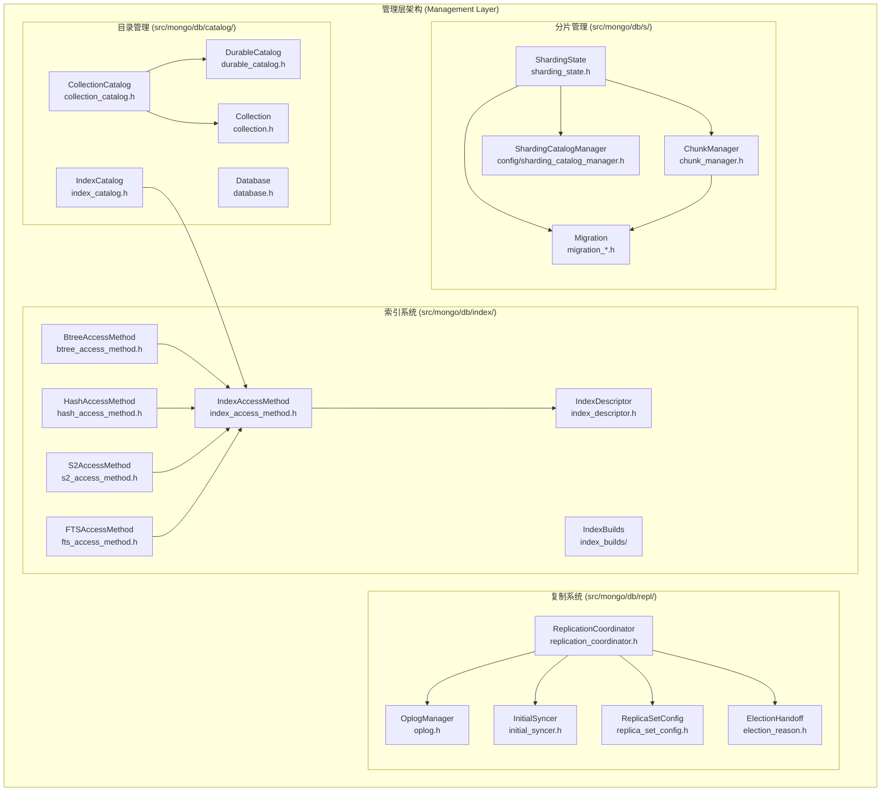
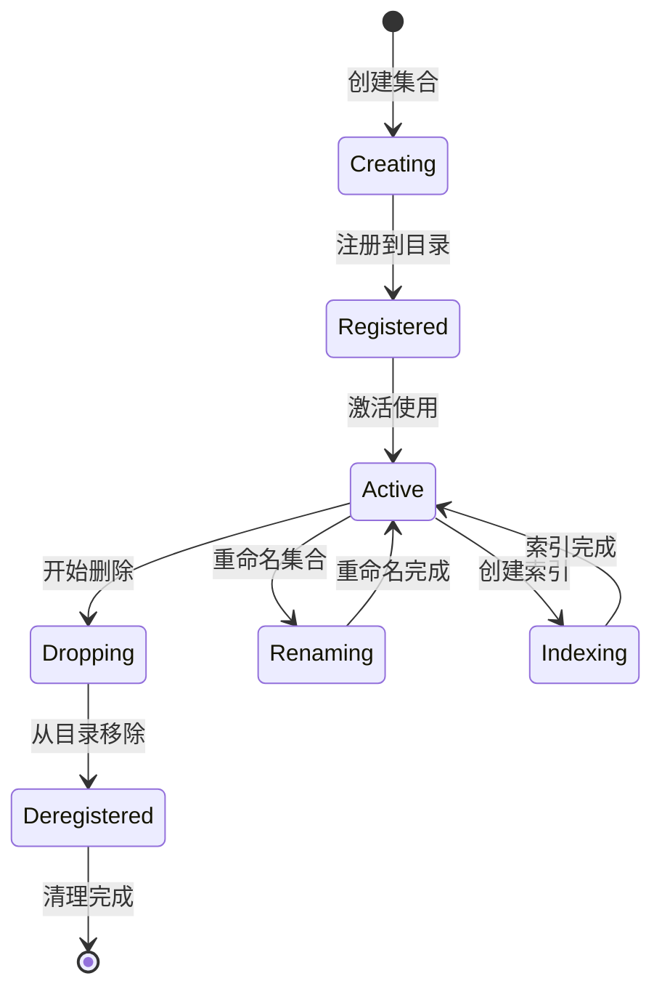
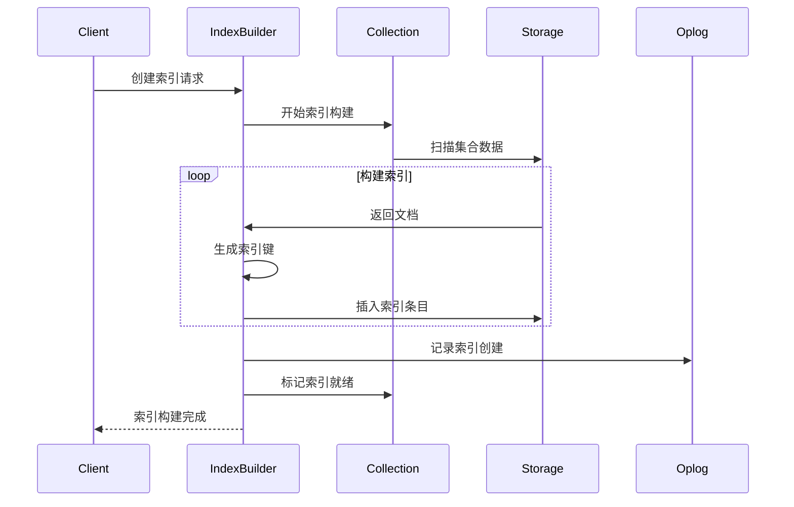
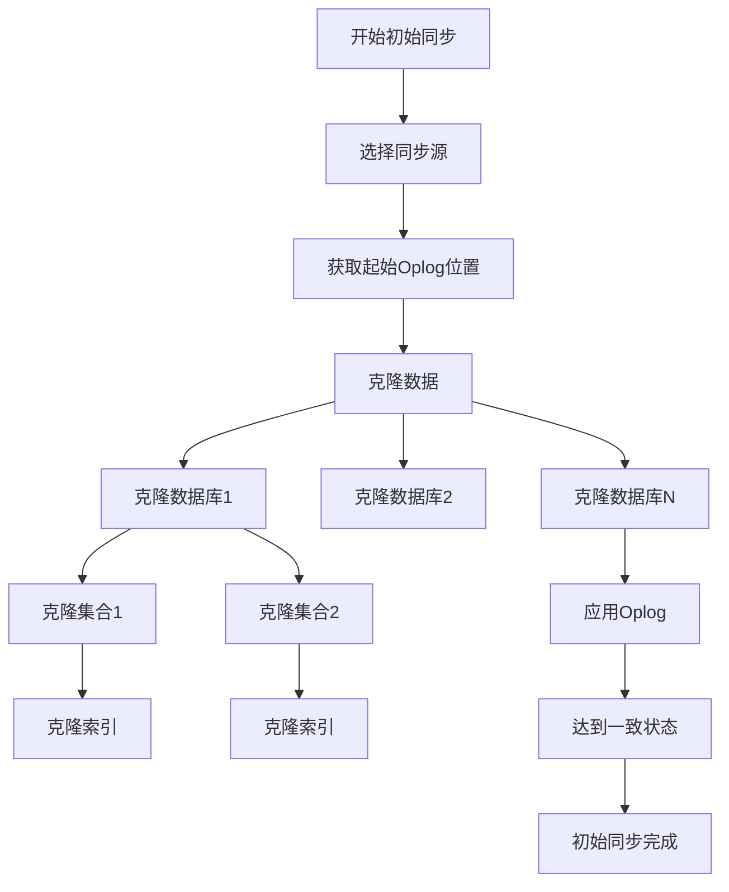
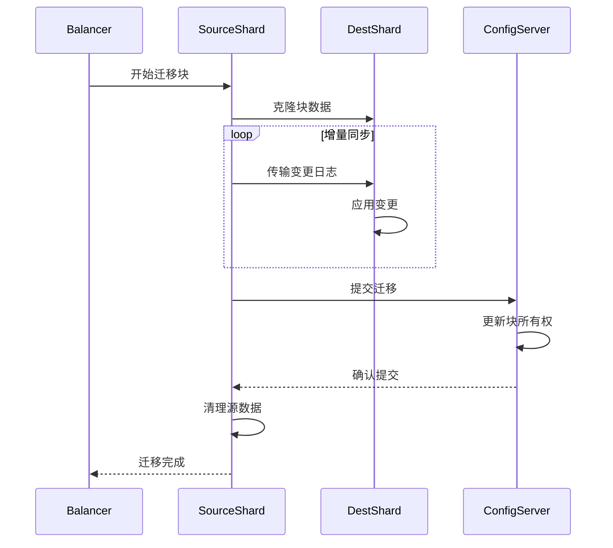
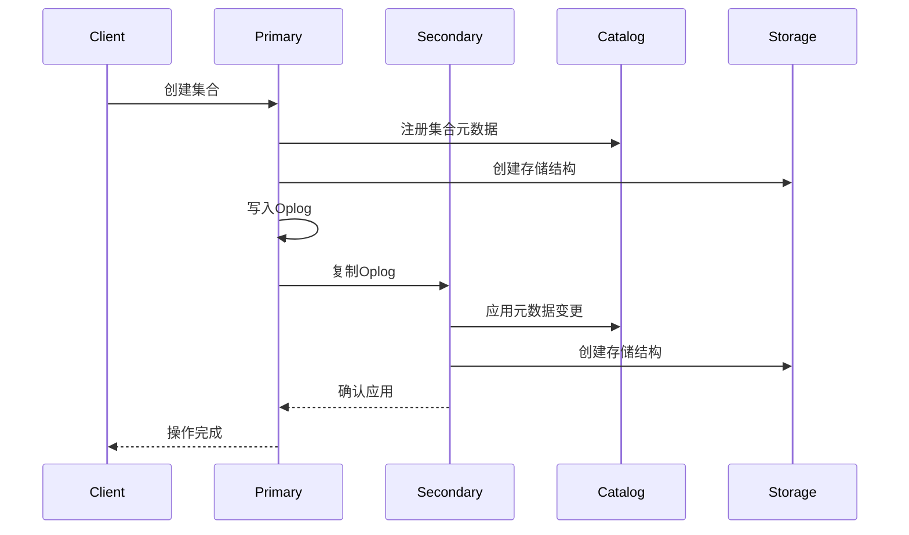

# MongoDB 管理层深度分析

## 概述

管理层是MongoDB数据管理的核心，负责目录管理、索引系统、复制协调和分片管理等关键功能。这一层为上层查询处理提供了统一的数据访问接口，并确保数据的一致性、可用性和分布式特性。

## 核心架构



## 1. 目录管理 (src/mongo/db/catalog/)

### 1.1 CollectionCatalog (`src/mongo/db/catalog/collection_catalog.h`)

CollectionCatalog是所有集合的内存目录，提供快速的集合查找和管理：

**核心功能**:
```cpp
class CollectionCatalog {
public:
    // 集合注册和查找
    void registerCollection(OperationContext* opCtx,
                           std::shared_ptr<Collection> coll,
                           boost::optional<Timestamp> commitTime);
    
    std::shared_ptr<const Collection> lookupCollectionByUUID(OperationContext* opCtx,
                                                            const UUID& uuid) const;
    
    std::shared_ptr<const Collection> lookupCollectionByNamespace(
        OperationContext* opCtx, const NamespaceString& nss) const;
    
    // 数据库操作
    std::vector<NamespaceString> getAllCollectionNamesFromDb(
        OperationContext* opCtx, const DatabaseName& dbName) const;
    
    // 迭代器支持
    auto range(const DatabaseName& dbName) const;
    
    // 统计信息
    uint64_t getEpoch() const { return _epoch; }
    size_t size() const;
    
private:
    // UUID到集合的映射
    stdx::unordered_map<UUID, std::shared_ptr<Collection>, UUID::Hash> _catalog;
    
    // 命名空间到UUID的映射
    StringMap<UUID> _collections;
    
    // 数据库到集合列表的映射
    StringMap<std::vector<UUID>> _orderedCollections;
    
    // 目录版本号
    uint64_t _epoch = 0;
    
    mutable stdx::shared_mutex _catalogLock;
};
```

**集合生命周期管理**:


### 1.2 DurableCatalog (`src/mongo/db/catalog/durable_catalog.h`)

DurableCatalog管理持久化的集合和索引元数据：

**持久化操作**:
```cpp
namespace durable_catalog {

// 创建集合
StatusWith<std::pair<RecordId, std::unique_ptr<RecordStore>>> createCollection(
    OperationContext* opCtx,
    const NamespaceString& nss,
    const std::string& ident,
    const CollectionOptions& options,
    MDBCatalog* mdbCatalog);

// 创建索引
Status createIndex(OperationContext* opCtx,
                   const RecordId& catalogId,
                   const NamespaceString& nss,
                   const CollectionOptions& collectionOptions,
                   const IndexConfig& indexConfig,
                   MDBCatalog* mdbCatalog);

// 删除集合
Status dropCollection(OperationContext* opCtx,
                     const RecordId& catalogId,
                     MDBCatalog* mdbCatalog);

// 重命名集合
Status renameCollection(OperationContext* opCtx,
                       const RecordId& catalogId,
                       const NamespaceString& toNss,
                       MDBCatalog* mdbCatalog);

} // namespace durable_catalog
```

**元数据格式**:
```cpp
// _mdb_catalog表中的BSON文档格式
{
    "_id": ObjectId("..."),
    "ns": "database.collection",
    "ident": "collection-uuid",
    "md": {
        "options": { ... },
        "indexes": [
            {
                "spec": { ... },
                "ready": true,
                "multikey": false,
                "multikeyPaths": { ... }
            }
        ]
    }
}
```

### 1.3 IndexCatalog (`src/mongo/db/catalog/index_catalog.h`)

IndexCatalog管理集合的所有索引：

**索引管理**:
```cpp
class IndexCatalog {
public:
    // 索引创建
    StatusWith<const IndexDescriptor*> createIndexOnEmptyCollection(
        OperationContext* opCtx,
        Collection* collection,
        const BSONObj& spec);
    
    // 索引查找
    const IndexDescriptor* findIdIndex(OperationContext* opCtx) const;
    const IndexDescriptor* findIndexByName(OperationContext* opCtx,
                                          StringData name,
                                          InclusionPolicy inclusionPolicy = InclusionPolicy::kReady) const;
    
    std::vector<const IndexDescriptor*> findIndexesByKeyPattern(
        OperationContext* opCtx,
        const BSONObj& key,
        InclusionPolicy inclusionPolicy = InclusionPolicy::kReady) const;
    
    // 索引迭代
    std::unique_ptr<IndexIterator> getIndexIterator(
        OperationContext* opCtx,
        InclusionPolicy inclusionPolicy) const;
    
    // 索引删除
    Status dropIndex(OperationContext* opCtx,
                    Collection* collection,
                    const IndexDescriptor* desc);
    
    // 索引重建
    Status rebuildIndexesOnCollection(OperationContext* opCtx,
                                     Collection* collection,
                                     const std::vector<BSONObj>& indexSpecs,
                                     RepairData repair);
    
private:
    std::vector<std::unique_ptr<IndexCatalogEntry>> _readyIndexes;
    std::vector<std::unique_ptr<IndexCatalogEntry>> _buildingIndexes;
};
```

## 2. 索引系统 (src/mongo/db/index/)

### 2.1 IndexAccessMethod (`src/mongo/db/index/index_access_method.h`)

IndexAccessMethod是所有索引访问方法的基类：

**索引访问接口**:
```cpp
class IndexAccessMethod {
public:
    // 索引操作
    virtual Status insert(OperationContext* opCtx,
                         SharedBufferFragmentBuilder& pooledBufferBuilder,
                         const CollectionPtr& coll,
                         const IndexCatalogEntry* entry,
                         const std::vector<BsonRecord>& bsonRecords,
                         const InsertDeleteOptions& options,
                         int64_t* numInserted) = 0;
    
    virtual void remove(OperationContext* opCtx,
                       SharedBufferFragmentBuilder& pooledBufferBuilder,
                       const CollectionPtr& coll,
                       const IndexCatalogEntry* entry,
                       const BSONObj& obj,
                       const RecordId& loc,
                       bool logIfError,
                       const InsertDeleteOptions& options,
                       int64_t* numDeleted,
                       CheckRecordId checkRecordId = CheckRecordId::Off) = 0;
    
    // 索引验证
    virtual Status validate(OperationContext* opCtx,
                           int64_t* numKeys,
                           IndexValidateResults* fullResults) const = 0;
    
    // 索引压缩
    virtual Status compact(OperationContext* opCtx) = 0;
    
    // 获取键
    virtual void getKeys(OperationContext* opCtx,
                        const CollectionPtr& collection,
                        const IndexCatalogEntry* entry,
                        SharedBufferFragmentBuilder& pooledBufferBuilder,
                        const BSONObj& obj,
                        InsertDeleteOptions options,
                        KeyStringSet* keys,
                        KeyStringSet* multikeyMetadataKeys,
                        MultikeyPaths* multikeyPaths,
                        const boost::optional<RecordId>& id = boost::none) const = 0;
};
```

### 2.2 索引类型实现

#### B树索引 (`src/mongo/db/index/btree_access_method.h`)
```cpp
class BtreeAccessMethod : public SortedDataIndexAccessMethod {
public:
    BtreeAccessMethod(IndexCatalogEntry* btreeState,
                     std::unique_ptr<SortedDataInterface> btree);
    
    void getKeys(OperationContext* opCtx,
                const CollectionPtr& collection,
                const IndexCatalogEntry* entry,
                SharedBufferFragmentBuilder& pooledBufferBuilder,
                const BSONObj& obj,
                InsertDeleteOptions options,
                KeyStringSet* keys,
                KeyStringSet* multikeyMetadataKeys,
                MultikeyPaths* multikeyPaths,
                const boost::optional<RecordId>& id = boost::none) const override;
};
```

#### 哈希索引 (`src/mongo/db/index/hash_access_method.h`)
```cpp
class HashAccessMethod : public SortedDataIndexAccessMethod {
public:
    HashAccessMethod(IndexCatalogEntry* catalog,
                    std::unique_ptr<SortedDataInterface> btree);
    
    void getKeys(OperationContext* opCtx,
                const CollectionPtr& collection,
                const IndexCatalogEntry* entry,
                SharedBufferFragmentBuilder& pooledBufferBuilder,
                const BSONObj& obj,
                InsertDeleteOptions options,
                KeyStringSet* keys,
                KeyStringSet* multikeyMetadataKeys,
                MultikeyPaths* multikeyPaths,
                const boost::optional<RecordId>& id = boost::none) const override;
    
private:
    int _hashVersion;
    std::string _hashField;
};
```

#### 地理空间索引 (`src/mongo/db/index/s2_access_method.h`)
```cpp
class S2AccessMethod : public SortedDataIndexAccessMethod {
public:
    S2AccessMethod(IndexCatalogEntry* catalog,
                  std::unique_ptr<SortedDataInterface> btree);
    
    void getKeys(OperationContext* opCtx,
                const CollectionPtr& collection,
                const IndexCatalogEntry* entry,
                SharedBufferFragmentBuilder& pooledBufferBuilder,
                const BSONObj& obj,
                InsertDeleteOptions options,
                KeyStringSet* keys,
                KeyStringSet* multikeyMetadataKeys,
                MultikeyPaths* multikeyPaths,
                const boost::optional<RecordId>& id = boost::none) const override;
    
private:
    S2IndexingParams _params;
};
```

### 2.3 索引构建 (`src/mongo/db/index_builds/`)

索引构建系统支持后台索引构建和混合索引构建：

**索引构建流程**:


## 3. 复制系统 (src/mongo/db/repl/)

### 3.1 ReplicationCoordinator (`src/mongo/db/repl/replication_coordinator.h`)

ReplicationCoordinator是复制系统的核心协调器：

**复制协调功能**:
```cpp
class ReplicationCoordinator {
public:
    // 复制集配置
    virtual Status setFollowerMode(const MemberState& newState) = 0;
    virtual MemberState getMemberState() const = 0;
    virtual Status waitForMemberState(MemberState expectedState, Milliseconds timeout) = 0;
    
    // 选举管理
    virtual Status stepUp(OperationContext* opCtx,
                         bool skipDryRun,
                         Milliseconds timeout) = 0;
    virtual Status stepDown(OperationContext* opCtx,
                           bool force,
                           const Milliseconds& waitTime,
                           const Milliseconds& stepdownTime) = 0;
    
    // Oplog管理
    virtual OpTime getMyLastAppliedOpTime() const = 0;
    virtual OpTime getMyLastDurableOpTime() const = 0;
    virtual Status setLastAppliedOptime(OperationContext* opCtx,
                                       const OpTime& opTime,
                                       DataConsistency consistency) = 0;
    
    // 写关注
    virtual Status awaitReplication(OperationContext* opCtx,
                                   const OpTime& opTime,
                                   const WriteConcernOptions& writeConcern) = 0;
    
    // 读关注
    virtual Status waitUntilOpTimeForRead(OperationContext* opCtx,
                                         const ReadConcernArgs& readConcern) = 0;
    
    // 同步源管理
    virtual HostAndPort chooseNewSyncSource(const OpTime& lastOpTimeFetched) = 0;
    virtual void blacklistSyncSource(const HostAndPort& host, Date_t until) = 0;
};
```

### 3.2 Oplog管理 (`src/mongo/db/repl/oplog.h`)

Oplog是复制系统的核心，记录所有写操作：

**Oplog操作**:
```cpp
namespace repl {

// 写入Oplog条目
void logOp(OperationContext* opCtx,
          const char* opstr,
          const NamespaceString& ns,
          const BSONObj& obj,
          const BSONObj* o2,
          bool fromMigrate,
          OpTime opTime,
          const OperationSessionInfo& sessionInfo,
          StmtId stmtId,
          const OplogLink& oplogLink);

// 应用Oplog条目
Status applyOperation_inlock(OperationContext* opCtx,
                            Database* db,
                            const OplogEntry& entry,
                            bool alwaysUpsert,
                            OplogApplication::Mode mode,
                            IncrementOpsAppliedStatsFn incrementOpsAppliedStats);

// 获取Oplog集合
Collection* getLocalOplogCollection(OperationContext* opCtx,
                                   const NamespaceString& oplogNss);

} // namespace repl
```

**Oplog条目格式**:
```cpp
// Oplog条目的BSON格式
{
    "ts": Timestamp(1234567890, 1),    // 时间戳
    "t": NumberLong(1),                // 任期
    "h": NumberLong(123456789),        // 哈希值
    "v": 2,                            // 版本
    "op": "i",                         // 操作类型 (i=insert, u=update, d=delete)
    "ns": "test.collection",           // 命名空间
    "o": { ... },                      // 操作对象
    "o2": { ... },                     // 查询条件(update/delete)
    "ui": UUID("..."),                 // 集合UUID
    "wall": ISODate("...")             // 墙上时钟时间
}
```

### 3.3 初始同步 (`src/mongo/db/repl/initial_syncer.h`)

初始同步用于新节点加入复制集时的数据同步：

**初始同步流程**:


## 4. 分片管理 (src/mongo/db/s/)

### 4.1 ShardingState (`src/mongo/db/s/sharding_state.h`)

ShardingState管理分片节点的状态：

**分片状态管理**:
```cpp
class ShardingState {
public:
    // 初始化分片状态
    void initializeFromShardIdentity(OperationContext* opCtx,
                                    const ShardIdentity& shardIdentity);
    
    // 获取分片标识
    boost::optional<ShardId> getShardId() const;
    boost::optional<std::string> getClusterId() const;
    
    // 分片版本管理
    ChunkVersion getVersion(const NamespaceString& nss) const;
    void setVersion(const NamespaceString& nss, const ChunkVersion& version);
    
    // 迁移状态
    void setMigrationCriticalSection(OperationContext* opCtx, const NamespaceString& nss);
    void clearMigrationCriticalSection(OperationContext* opCtx, const NamespaceString& nss);
    
private:
    mutable stdx::mutex _mutex;
    boost::optional<ShardIdentity> _shardIdentity;
    stdx::unordered_map<NamespaceString, ChunkVersion> _versions;
};
```

### 4.2 ChunkManager (`src/mongo/db/s/chunk_manager.h`)

ChunkManager管理集合的分片信息：

**块管理功能**:
```cpp
class ChunkManager {
public:
    // 查找块
    std::shared_ptr<Chunk> findIntersectingChunk(const BSONObj& shardKey) const;
    std::vector<std::shared_ptr<Chunk>> getChunksForRange(const ChunkRange& range) const;
    
    // 分片键操作
    BSONObj getShardKeyPattern() const;
    bool keyBelongsToShard(const BSONObj& shardKey, const ShardId& shardId) const;
    
    // 块分割
    std::vector<ChunkRange> splitChunk(const Chunk& chunk,
                                      const std::vector<BSONObj>& splitPoints) const;
    
    // 块迁移
    Status moveChunk(OperationContext* opCtx,
                    const Chunk& chunk,
                    const ShardId& toShard,
                    const MigrationSecondaryThrottleOptions& secondaryThrottle);
    
    // 统计信息
    int numChunks() const;
    std::map<ShardId, int> getShardChunkCounts() const;
    
private:
    ShardKeyPattern _shardKeyPattern;
    ChunkMap _chunkMap;
    ShardVersionMap _shardVersions;
};
```

### 4.3 数据迁移 (`src/mongo/db/s/migration_*.h`)

分片系统支持在线数据迁移：

**迁移流程**:


## 5. 管理层交互

### 5.1 DDL操作协调



### 5.2 分片集合管理

```cpp
class ShardingCatalogManager {
public:
    // 分片集合
    Status shardCollection(OperationContext* opCtx,
                          const NamespaceString& nss,
                          const ShardKeyPattern& shardKey,
                          const BSONObj& defaultCollation,
                          bool unique,
                          const std::vector<BSONObj>& splitPoints,
                          const std::set<ShardId>& initShards);
    
    // 添加分片
    StatusWith<std::string> addShard(OperationContext* opCtx,
                                    const std::string* shardProposedName,
                                    const ConnectionString& shardConnectionString,
                                    bool isConfigShard);
    
    // 移除分片
    Status removeShard(OperationContext* opCtx, const ShardId& shardId);
    
    // 分割块
    Status splitChunk(OperationContext* opCtx,
                     const NamespaceString& nss,
                     const BSONObj& keyPattern,
                     const ChunkRange& chunkRange,
                     const std::vector<BSONObj>& splitPoints,
                     const std::string& shardName,
                     const OID& expectedCollectionEpoch);
};
```

## 6. 性能优化

### 6.1 目录缓存优化

```cpp
class CollectionCatalog {
private:
    // 使用读写锁提高并发性能
    mutable stdx::shared_mutex _catalogLock;
    
    // 分层缓存结构
    struct CatalogCache {
        stdx::unordered_map<UUID, std::weak_ptr<Collection>, UUID::Hash> _uuidCache;
        StringMap<UUID> _namespaceCache;
        uint64_t _epoch;
    };
    
    // 线程本地缓存
    thread_local CatalogCache _tlsCache;
};
```

### 6.2 索引构建优化

```cpp
class IndexBuilder {
private:
    // 并行索引构建
    void buildIndexesInParallel(const std::vector<IndexSpec>& specs);
    
    // 内存使用控制
    size_t _maxMemoryUsage;
    size_t _currentMemoryUsage;
    
    // 批量插入优化
    void insertKeysBatch(const std::vector<KeyString>& keys);
};
```

管理层为MongoDB提供了完整的数据管理能力，通过目录系统、索引系统、复制系统和分片系统的协调工作，确保了数据的一致性、可用性和可扩展性。
