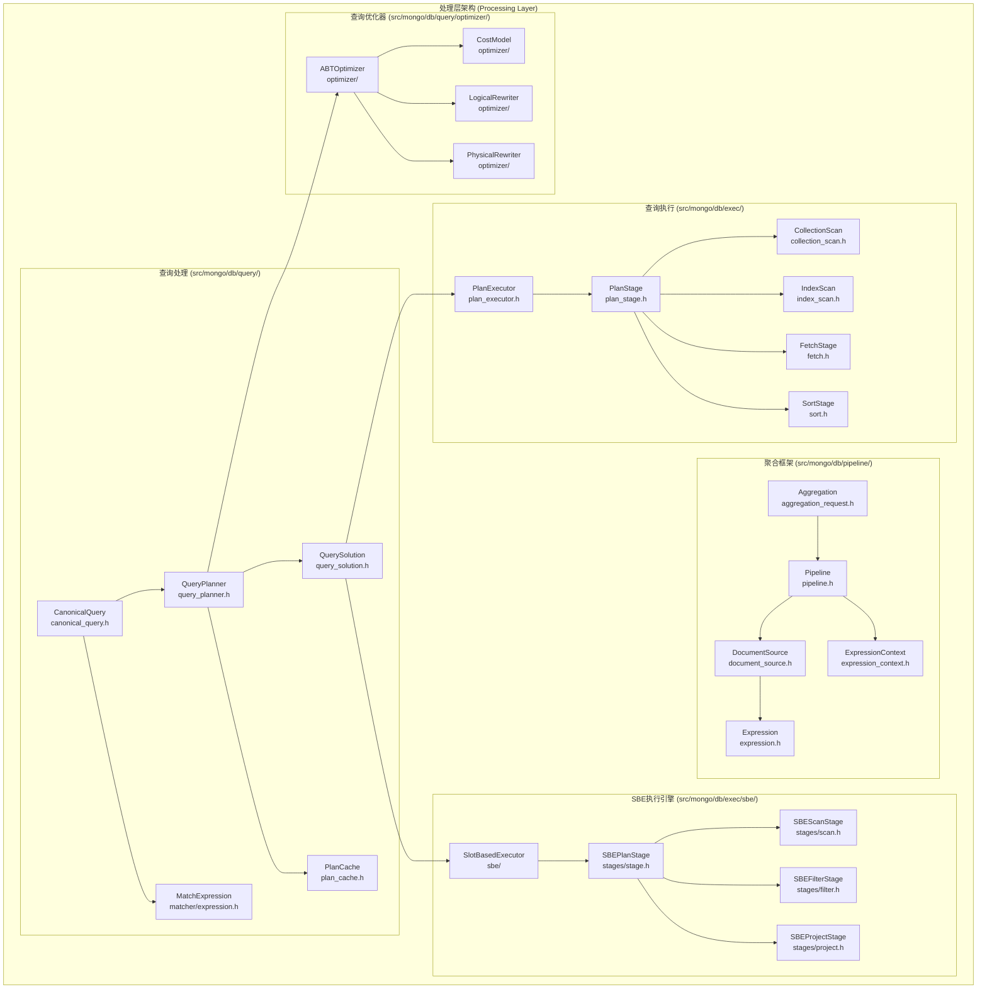
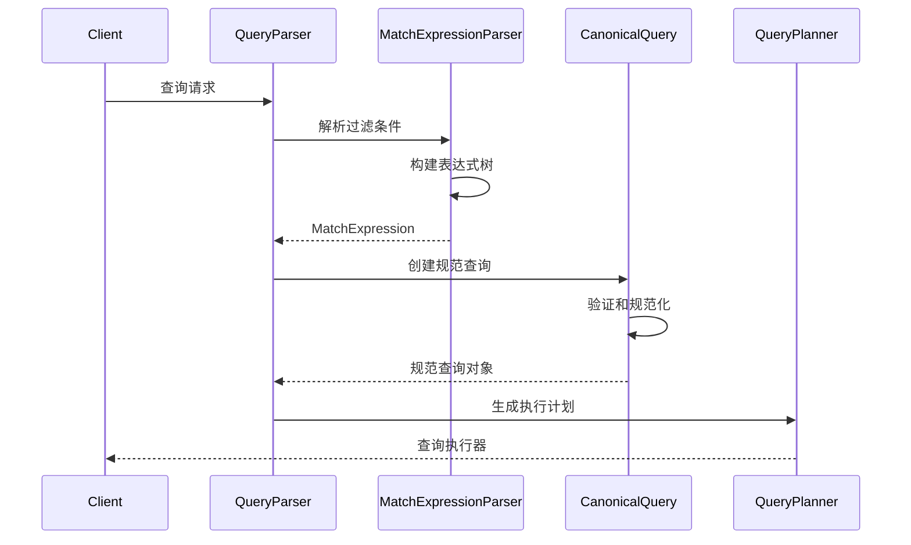
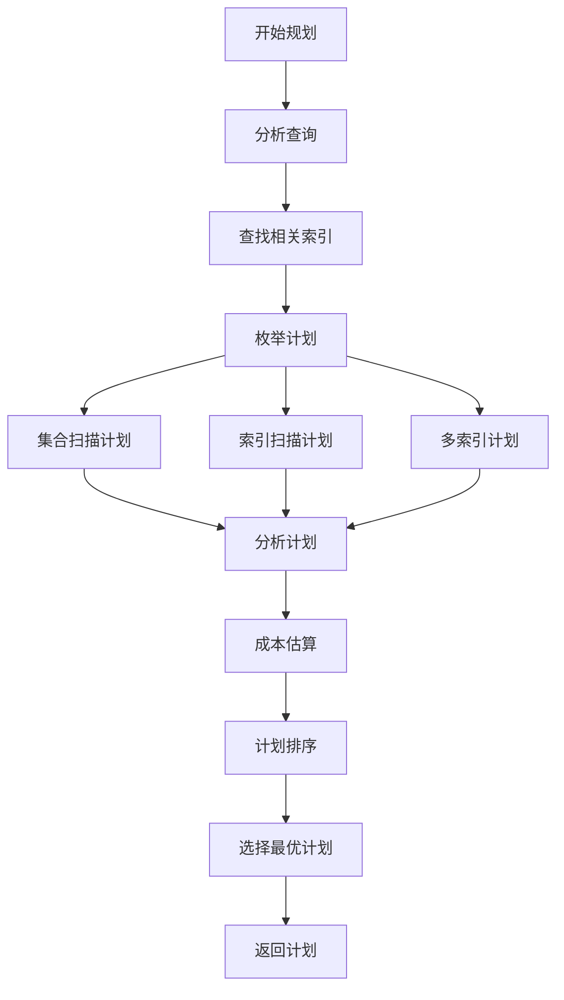
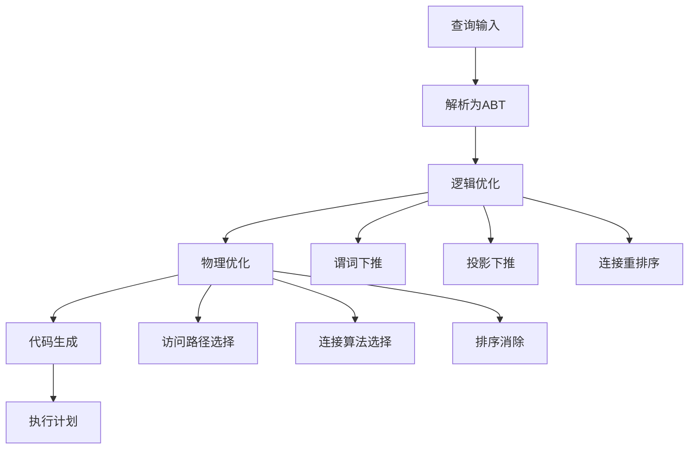

# MongoDB 处理层深度分析

## 概述

处理层是MongoDB查询处理的核心，负责查询解析、规划、优化和执行。这一层包含查询处理系统、聚合框架和多种执行引擎，为用户提供高性能的数据查询和处理能力。

## 核心架构



## 1. 查询处理系统 (src/mongo/db/query/)

### 1.1 CanonicalQuery (`src/mongo/db/query/canonical_query.h`)

CanonicalQuery是查询的规范化表示：

**查询规范化**:
```cpp
class CanonicalQuery {
public:
    // 创建规范查询
    static StatusWith<std::unique_ptr<CanonicalQuery>> canonicalize(
        OperationContext* opCtx,
        std::unique_ptr<QueryRequest> qr,
        bool explain = false,
        const boost::intrusive_ptr<ExpressionContext>& expCtx = nullptr,
        const ExtensionsCallback& extensionsCallback = ExtensionsCallback(),
        MatchExpressionParser::AllowedFeatureSet allowedFeatures = 
            MatchExpressionParser::kDefaultSpecialFeatures);
    
    // 查询组件访问
    const QueryRequest& getQueryRequest() const { return *_qr; }
    const MatchExpression* root() const { return _root.get(); }
    const Projection* getProj() const { return _proj.get(); }
    const ParsedSort* getSort() const { return _sort.get(); }
    
    // 查询属性
    bool isSimpleIdQuery() const;
    bool hasLimit() const { return _qr->getLimit().has_value(); }
    bool hasSkip() const { return _qr->getSkip().has_value(); }
    
    // 查询字符串表示
    std::string toString() const;
    std::string toStringShort() const;
    
private:
    std::unique_ptr<QueryRequest> _qr;
    std::unique_ptr<MatchExpression> _root;
    std::unique_ptr<Projection> _proj;
    std::unique_ptr<ParsedSort> _sort;
    boost::intrusive_ptr<ExpressionContext> _expCtx;
};
```

**查询解析流程**:


### 1.2 QueryPlanner (`src/mongo/db/query/query_planner.h`)

QueryPlanner负责生成查询执行计划：

**计划生成**:
```cpp
class QueryPlanner {
public:
    // 生成查询计划
    static StatusWith<std::vector<std::unique_ptr<QuerySolution>>> plan(
        const CanonicalQuery& query, 
        const QueryPlannerParams& params);
    
    // 从缓存获取计划
    static StatusWith<std::unique_ptr<QuerySolution>> planFromCache(
        const CanonicalQuery& query,
        const QueryPlannerParams& params,
        const CachedSolution& cachedSoln);
    
    // 基于成本的计划排序
    static StatusWith<CostBasedRankerResult> planWithCostBasedRanking(
        const CanonicalQuery& query,
        const QueryPlannerParams& params,
        const ce::SamplingEstimator* samplingEstimator);
    
    // 计划分析
    static std::unique_ptr<QuerySolution> analyzeDataAccess(
        const CanonicalQuery& query,
        const QueryPlannerParams& params,
        std::unique_ptr<QuerySolutionNode> solnRoot);
        
private:
    // 索引选择
    static void findRelevantIndices(std::vector<IndexEntry>* out,
                                   const std::vector<IndexEntry>& allIndices,
                                   const MatchExpression* query);
    
    // 计划枚举
    static Status enumeratePlans(const CanonicalQuery& query,
                                const QueryPlannerParams& params,
                                std::vector<std::unique_ptr<QuerySolution>>* out);
};
```

**计划生成流程**:


### 1.3 QuerySolution (`src/mongo/db/query/query_solution.h`)

QuerySolution表示一个完整的查询执行计划：

**计划表示**:
```cpp
class QuerySolution {
public:
    // 计划根节点
    std::unique_ptr<QuerySolutionNode> root;
    
    // 计划属性
    bool hasBlockingStage = false;
    bool indexFilterApplied = false;
    size_t plannerOptions = 0;
    
    // 计划统计
    std::unique_ptr<SolutionCacheData> cacheData;
    
    // 计划字符串表示
    std::string toString() const;
    
    // 计划克隆
    std::unique_ptr<QuerySolution> clone() const;
    
    // 计划验证
    void validate() const;
};

// 查询解决方案节点基类
class QuerySolutionNode {
public:
    virtual ~QuerySolutionNode() = default;
    
    // 节点类型
    virtual StageType getType() const = 0;
    
    // 节点克隆
    virtual std::unique_ptr<QuerySolutionNode> clone() const = 0;
    
    // 节点字符串表示
    virtual void appendToString(str::stream* ss, int indent) const = 0;
    
    // 子节点
    std::vector<std::unique_ptr<QuerySolutionNode>> children;
    
    // 过滤条件
    std::unique_ptr<MatchExpression> filter;
};
```

### 1.4 PlanCache (`src/mongo/db/query/plan_cache.h`)

PlanCache缓存查询计划以提高性能：

**缓存管理**:
```cpp
class PlanCache {
public:
    // 缓存条目
    struct CacheEntry {
        std::unique_ptr<CachedSolution> cachedSolution;
        uint32_t queryHash;
        uint32_t planCacheKey;
        Date_t timeOfCreation;
        bool isActive = false;
        uint32_t works = 0;
    };
    
    // 缓存操作
    Status set(const CanonicalQuery& query,
              const std::vector<QuerySolution*>& solns,
              std::unique_ptr<PlanRankingDecision> decision,
              Date_t now);
    
    StatusWith<std::unique_ptr<CachedSolution>> get(const CanonicalQuery& query) const;
    
    Status remove(const CanonicalQuery& query);
    void clear();
    
    // 缓存统计
    size_t size() const;
    std::vector<BSONObj> getAllPlans() const;
    
private:
    // 缓存键生成
    uint32_t computeKey(const CanonicalQuery& query) const;
    
    // LRU缓存实现
    mutable stdx::mutex _cacheMutex;
    std::map<uint32_t, std::unique_ptr<CacheEntry>> _cache;
    size_t _maxSize;
};
```

## 2. 聚合框架 (src/mongo/db/pipeline/)

### 2.1 Pipeline (`src/mongo/db/pipeline/pipeline.h`)

Pipeline表示聚合管道：

**管道管理**:
```cpp
class Pipeline {
public:
    // 管道创建
    static std::unique_ptr<Pipeline, PipelineDeleter> makePipeline(
        const std::vector<BSONObj>& rawPipeline,
        const boost::intrusive_ptr<ExpressionContext>& expCtx,
        MakePipelineOptions opts = MakePipelineOptions{});
    
    // 管道执行
    boost::optional<Document> getNext();
    std::vector<Value> writeExplainOps(ExplainOptions::Verbosity verbosity) const;
    
    // 管道优化
    void optimizePipeline();
    Pipeline* splitForSharded(Pipeline::SplitState* splitState);
    
    // 管道操作
    void addInitialSource(boost::intrusive_ptr<DocumentSource> source);
    void addFinalSource(boost::intrusive_ptr<DocumentSource> source);
    
    // 管道属性
    bool needsPrimaryShardMerger() const;
    bool needsMongosMerger() const;
    bool canRunOnMongos() const;
    
    // 管道阶段访问
    const std::list<boost::intrusive_ptr<DocumentSource>>& getSources() const { return _sources; }
    
private:
    std::list<boost::intrusive_ptr<DocumentSource>> _sources;
    boost::intrusive_ptr<ExpressionContext> _expCtx;
    bool _optimized = false;
};
```

### 2.2 DocumentSource (`src/mongo/db/pipeline/document_source.h`)

DocumentSource是聚合阶段的基类：

**阶段接口**:
```cpp
class DocumentSource {
public:
    // 文档处理
    virtual GetNextResult getNext() = 0;
    virtual void dispose() {}
    
    // 阶段优化
    virtual Pipeline::SourceContainer::iterator doOptimizeAt(
        Pipeline::SourceContainer::iterator itr,
        Pipeline::SourceContainer* container) {
        return std::next(itr);
    }
    
    // 依赖分析
    virtual DepsTracker::State getDependencies(DepsTracker* deps) const {
        return DepsTracker::State::SEE_NEXT;
    }
    
    // 阶段属性
    virtual StageConstraints constraints(Pipeline::SplitState pipeState) const = 0;
    virtual boost::optional<DistributedPlanLogic> distributedPlanLogic() = 0;
    
    // 阶段序列化
    virtual Value serialize(const SerializationOptions& opts = SerializationOptions{}) const = 0;
    
    // 阶段名称
    virtual const char* getSourceName() const = 0;
    
protected:
    boost::intrusive_ptr<ExpressionContext> pExpCtx;
};
```

### 2.3 常见聚合阶段

#### $match阶段 (`src/mongo/db/pipeline/document_source_match.h`)
```cpp
class DocumentSourceMatch final : public DocumentSource {
public:
    static boost::intrusive_ptr<DocumentSourceMatch> create(
        BSONObj filter,
        const boost::intrusive_ptr<ExpressionContext>& expCtx);
    
    GetNextResult getNext() override;
    const char* getSourceName() const override { return kStageName; }
    
    // 优化
    Pipeline::SourceContainer::iterator doOptimizeAt(
        Pipeline::SourceContainer::iterator itr,
        Pipeline::SourceContainer* container) override;
    
    // 匹配表达式访问
    const MatchExpression* getMatchExpression() const { return _expression.get(); }
    
private:
    std::unique_ptr<MatchExpression> _expression;
    bool _isTextQuery = false;
};
```

#### $group阶段 (`src/mongo/db/pipeline/document_source_group.h`)
```cpp
class DocumentSourceGroup final : public DocumentSource {
public:
    static boost::intrusive_ptr<DocumentSourceGroup> create(
        const boost::intrusive_ptr<ExpressionContext>& expCtx,
        const boost::intrusive_ptr<Expression>& groupByExpression,
        std::vector<AccumulationStatement> accumulationStatements,
        size_t maxMemoryUsageBytes = 0);
    
    GetNextResult getNext() override;
    const char* getSourceName() const override { return kStageName; }
    
    // 分组逻辑
    void addToGroup(const Value& id, const Document& root);
    Document makeDocument(const Value& id, const Accumulators& accums, bool mergeableOutput);
    
private:
    boost::intrusive_ptr<Expression> _idExpression;
    std::vector<AccumulationStatement> _accumulatedFields;
    ValueUnorderedMap<Accumulators> _groups;
    bool _streaming = false;
};
```

## 3. 查询执行引擎 (src/mongo/db/exec/)

### 3.1 PlanExecutor (`src/mongo/db/query/plan_executor.h`)

PlanExecutor是查询执行的统一接口：

**执行器接口**:
```cpp
class PlanExecutor {
public:
    enum ExecState {
        ADVANCED,      // 返回了一个结果
        IS_EOF,        // 没有更多结果
        FAILURE        // 执行失败
    };
    
    // 执行操作
    virtual ExecState getNext(BSONObj* objOut, RecordId* dlOut) = 0;
    virtual ExecState getNext(Document* objOut, RecordId* dlOut) = 0;
    
    // 执行器状态
    virtual bool isEOF() = 0;
    virtual void dispose(OperationContext* opCtx) = 0;
    virtual void detachFromOperationContext() = 0;
    virtual void reattachToOperationContext(OperationContext* opCtx) = 0;
    
    // 执行统计
    virtual std::unique_ptr<PlanExplainer> getPlanExplainer() const = 0;
    virtual Timestamp getLatestOplogTimestamp() const = 0;
    
    // 执行器类型
    virtual PlanExecutorType getType() const = 0;
    
protected:
    OperationContext* _opCtx;
    std::unique_ptr<CanonicalQuery> _cq;
    NamespaceString _nss;
};
```

### 3.2 PlanStage (`src/mongo/db/exec/plan_stage.h`)

PlanStage是执行阶段的基类：

**阶段执行**:
```cpp
class PlanStage {
public:
    enum StageState {
        NEED_TIME,     // 需要更多时间
        NEED_YIELD,    // 需要让出控制权
        ADVANCED,      // 产生了一个结果
        IS_EOF         // 没有更多结果
    };
    
    // 执行操作
    StageState work(WorkingSetID* out);
    
    // 状态管理
    virtual void saveState() = 0;
    virtual void restoreState(const RestoreContext& context) = 0;
    virtual void detachFromOperationContext() = 0;
    virtual void reattachToOperationContext(OperationContext* opCtx) = 0;
    
    // 阶段属性
    virtual StageType stageType() const = 0;
    virtual std::unique_ptr<PlanStageStats> getStats() = 0;
    virtual const SpecificStats* getSpecificStats() const = 0;
    
    // 子阶段管理
    virtual std::vector<const PlanStage*> getChildren() const = 0;
    virtual size_t getNumChildren() const = 0;
    
protected:
    // 具体执行逻辑
    virtual StageState doWork(WorkingSetID* out) = 0;
    
    OperationContext* _opCtx;
    WorkingSet* _ws;
    CommonStats _commonStats;
};
```

### 3.3 执行阶段实现

#### CollectionScan (`src/mongo/db/exec/collection_scan.h`)
```cpp
class CollectionScan final : public PlanStage {
public:
    CollectionScan(ExpressionContext* expCtx,
                  VariantCollectionPtrOrAcquisition collection,
                  CollectionScanParams params,
                  WorkingSet* ws,
                  const MatchExpression* filter);
    
    StageState doWork(WorkingSetID* out) override;
    StageType stageType() const override { return STAGE_COLLSCAN; }
    
private:
    CollectionScanParams _params;
    std::unique_ptr<SeekableRecordCursor> _cursor;
    const MatchExpression* _filter;
    CollectionScanStats _specificStats;
};
```

#### IndexScan (`src/mongo/db/exec/index_scan.h`)
```cpp
class IndexScan final : public PlanStage {
public:
    IndexScan(ExpressionContext* expCtx,
             VariantCollectionPtrOrAcquisition collection,
             IndexScanParams params,
             WorkingSet* ws,
             const MatchExpression* filter);
    
    StageState doWork(WorkingSetID* out) override;
    StageType stageType() const override { return STAGE_IXSCAN; }
    
private:
    IndexScanParams _params;
    std::unique_ptr<SortedDataInterface::Cursor> _indexCursor;
    const IndexDescriptor* _indexDescriptor;
    IndexScanStats _specificStats;
};
```

## 4. SBE执行引擎 (src/mongo/db/exec/sbe/)

### 4.1 Slot-Based执行模型

SBE使用基于槽位的执行模型：

**槽位系统**:
```cpp
namespace sbe {

using SlotId = int64_t;
using SlotAccessor = value::SlotAccessor;
using SlotVector = std::vector<SlotId>;
using SlotMap = stdx::unordered_map<SlotId, std::unique_ptr<SlotAccessor>>;

class PlanStage {
public:
    enum PlanState {
        NEED_TIME,
        ADVANCED,
        IS_EOF
    };
    
    // 执行操作
    virtual PlanState getNext() = 0;
    
    // 槽位管理
    virtual std::unique_ptr<SlotAccessor> getAccessor(SlotId slot) = 0;
    virtual void prepare(CompileCtx& ctx) = 0;
    
    // 状态管理
    virtual void open(bool reOpen) = 0;
    virtual void close() = 0;
    
protected:
    std::vector<std::unique_ptr<PlanStage>> _children;
    SlotVector _requiredSlots;
};

} // namespace sbe
```

### 4.2 SBE阶段实现

#### ScanStage (`src/mongo/db/exec/sbe/stages/scan.h`)
```cpp
class ScanStage final : public PlanStage {
public:
    ScanStage(UUID collectionUuid,
             boost::optional<SlotId> recordSlot,
             boost::optional<SlotId> recordIdSlot,
             boost::optional<SlotId> snapshotIdSlot,
             boost::optional<SlotId> indexIdSlot,
             boost::optional<SlotId> indexKeySlot,
             boost::optional<SlotId> indexKeyPatternSlot,
             boost::optional<SlotId> oplogTsSlot,
             std::vector<std::string> fields,
             SlotVector vars,
             boost::optional<SlotId> seekKeySlot,
             bool forward,
             PlanYieldPolicy* yieldPolicy,
             PlanNodeId nodeId,
             ScanCallbacks scanCallbacks);
    
    PlanState getNext() override;
    void prepare(CompileCtx& ctx) override;
    
private:
    UUID _collUuid;
    boost::optional<SlotId> _recordSlot;
    boost::optional<SlotId> _recordIdSlot;
    std::unique_ptr<SeekableRecordCursor> _cursor;
};
```

## 5. 查询优化器 (src/mongo/db/query/optimizer/)

### 5.1 ABT优化器

新一代基于代数的查询优化器：

**优化流程**:


### 5.2 成本模型

```cpp
class CostEstimator {
public:
    // 成本估算
    CostType estimateCost(const ABT& node,
                         const EstimateMap& estimates,
                         const CostModelCoefficients& coeffs) const;
    
    // 基数估算
    CEType estimateCardinality(const ABT& node,
                              const EstimateMap& estimates) const;
    
private:
    // 操作成本
    CostType estimateScanCost(const ScanNode& node) const;
    CostType estimateFilterCost(const FilterNode& node) const;
    CostType estimateJoinCost(const JoinNode& node) const;
};
```

## 6. 性能优化

### 6.1 计划缓存优化

```cpp
class PlanCacheOptimizer {
public:
    // 缓存策略
    bool shouldCache(const CanonicalQuery& query,
                    const std::vector<QuerySolution*>& solutions) const;
    
    // 缓存失效
    void invalidateCache(const NamespaceString& nss,
                        const std::string& indexName) const;
    
    // 缓存预热
    void warmupCache(const std::vector<BSONObj>& queries) const;
};
```

### 6.2 并行执行

```cpp
class ParallelExecutor {
public:
    // 并行扫描
    std::vector<std::unique_ptr<PlanExecutor>> createParallelScanExecutors(
        const CanonicalQuery& query,
        size_t numThreads) const;
    
    // 结果合并
    std::unique_ptr<PlanExecutor> createMergeExecutor(
        std::vector<std::unique_ptr<PlanExecutor>> executors) const;
};
```

处理层为MongoDB提供了强大的查询处理能力，通过多层次的优化和多种执行引擎，确保了查询的高性能执行和灵活的数据处理能力。
