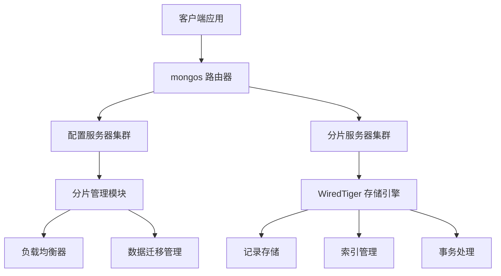
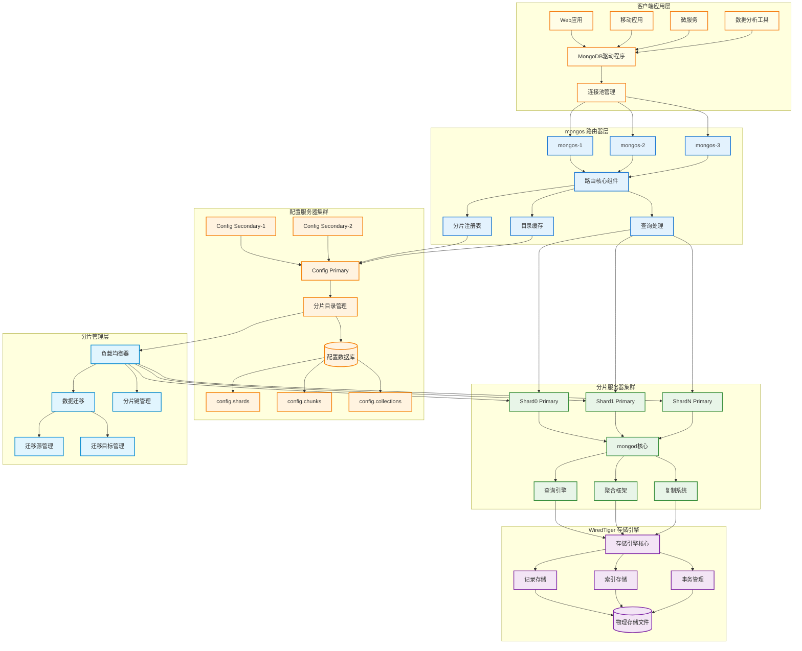

# MongoDB 核心模块架构总结

## 概述

本文档汇总了 MongoDB 核心模块的深度分析结果，包括 mongos 路由器、配置服务器、WiredTiger 存储引擎和分片管理等关键组件的架构设计和实现细节。

## 模块架构概览

### 1. 整体架构层次






### 2. 核心模块关系

| 模块 | 主要职责 | 关键组件 | 源码位置 |
|------|----------|----------|----------|
| mongos 路由器 | 查询路由和负载均衡 | ServiceEntryPointRouterRole, Grid, CollectionRoutingInfoTargeter | `src/mongo/s/` |
| 配置服务器 | 元数据管理和集群协调 | ShardingCatalogManager, ShardingInitializationMongoD | `src/mongo/db/s/config/` |
| WiredTiger 存储引擎 | 数据存储和事务管理 | WiredTigerKVEngine, WiredTigerRecordStore, WiredTigerRecoveryUnit | `src/mongo/db/storage/wiredtiger/` |
| 分片管理 | 数据分布和迁移 | ShardKeyPattern, Balancer, MigrationSourceManager | `src/mongo/s/`, `src/mongo/db/s/balancer/` |

## 关键设计模式和原则

### 1. 架构设计模式

#### 分层架构
- **表示层**: mongos 路由器处理客户端请求
- **业务层**: 分片管理和查询处理
- **数据层**: WiredTiger 存储引擎
- **基础设施层**: 网络通信和系统服务

#### 微服务架构
- **服务分离**: 路由、配置、存储、分片管理独立
- **松耦合**: 通过标准接口通信
- **可扩展**: 各服务可独立扩展

#### 事件驱动架构
- **异步处理**: 使用 Future/Promise 模式
- **事件通知**: 配置变更触发缓存更新
- **响应式**: 负载变化触发自动均衡

### 2. 核心设计原则

#### 高可用性
- **无单点故障**: 所有组件都支持集群部署
- **故障转移**: 自动检测和处理节点故障
- **数据冗余**: 复制集保证数据安全

#### 水平扩展
- **无状态设计**: mongos 路由器无状态
- **分片机制**: 数据自动分布到多个节点
- **动态扩容**: 支持在线添加分片

#### 数据一致性
- **MVCC**: 多版本并发控制
- **事务支持**: ACID 事务保证
- **版本控制**: 元数据版本管理

## 性能优化策略

### 1. 缓存机制

#### 多层缓存架构
```
应用缓存 -> mongos 缓存 -> 分片本地缓存 -> WiredTiger 缓存
```

#### 缓存策略
- **路由信息缓存**: mongos 缓存分片路由信息
- **元数据缓存**: 本地缓存配置服务器数据
- **查询计划缓存**: 缓存常用查询的执行计划
- **存储引擎缓存**: WiredTiger 内存缓存

### 2. 并发优化

#### 锁机制优化
- **意向锁**: 减少锁冲突
- **文档级锁**: WiredTiger 提供文档级并发
- **读写分离**: 读操作不阻塞写操作

#### 异步处理
- **非阻塞 I/O**: 网络和磁盘操作异步化
- **线程池**: 专门的线程池处理不同类型任务
- **批量操作**: 批量处理提高吞吐量

### 3. 存储优化

#### 数据压缩
- **块级压缩**: WiredTiger 支持多种压缩算法
- **索引压缩**: 索引数据也支持压缩
- **网络压缩**: 分片间通信支持压缩

#### I/O 优化
- **预读机制**: 智能预读提高顺序访问性能
- **写入合并**: 合并连续写入减少 I/O
- **检查点优化**: 优化检查点创建频率

## 扩展性设计

### 1. 水平扩展

#### 分片扩展
```javascript
// 添加新分片
sh.addShard("shard0003/host1:27018,host2:27018,host3:27018")

// 自动负载均衡
sh.enableBalancing("mydb.mycoll")
```

#### 路由器扩展
- **多 mongos 实例**: 部署多个 mongos 实现负载均衡
- **连接池**: 客户端连接池分散请求
- **DNS 负载均衡**: 使用 DNS 轮询分发请求

### 2. 垂直扩展

#### 硬件优化
- **内存扩展**: 增加 WiredTiger 缓存大小
- **存储优化**: 使用 SSD 提高 I/O 性能
- **网络优化**: 高速网络减少分片间延迟

#### 配置优化
- **连接数调优**: 优化连接池大小
- **缓存调优**: 调整各级缓存大小
- **并发调优**: 优化线程池配置

## 监控和运维

### 1. 监控指标

#### 性能指标
- **QPS**: 每秒查询数
- **延迟**: 查询响应时间
- **吞吐量**: 数据传输速率
- **资源使用**: CPU、内存、磁盘使用率

#### 集群健康指标
- **分片状态**: 各分片的健康状态
- **复制延迟**: 主从复制的延迟
- **均衡状态**: 数据分布是否均衡
- **迁移进度**: 数据迁移的进度

### 2. 运维工具

#### 管理命令
```javascript
// 集群状态
sh.status()

// 分片统计
db.stats()

// 均衡器状态
sh.getBalancerState()

// 迁移状态
sh.isBalancerRunning()
```

#### 监控工具
- **MongoDB Compass**: 图形化管理工具
- **MongoDB Atlas**: 云端监控平台
- **第三方工具**: Prometheus、Grafana 等

## 最佳实践

### 1. 分片键设计

#### 选择原则
- **高基数**: 确保数据均匀分布
- **查询友好**: 常用查询包含分片键
- **避免热点**: 防止数据集中在少数分片
- **考虑增长**: 预测数据增长模式

#### 常见模式
```javascript
// 用户数据分片
{ userId: "hashed" }

// 时间序列数据分片
{ timestamp: 1, deviceId: 1 }

// 地理位置数据分片
{ region: 1, userId: 1 }
```

### 2. 集群规划

#### 硬件配置
- **配置服务器**: 3 节点复制集，SSD 存储
- **分片服务器**: 根据数据量规划，建议 3 节点复制集
- **mongos 路由器**: 无状态，可部署在应用服务器上

#### 网络规划
- **专用网络**: 分片间使用专用网络
- **带宽规划**: 考虑数据迁移的带宽需求
- **延迟优化**: 减少跨数据中心延迟

### 3. 性能调优

#### 索引优化
- **复合索引**: 根据查询模式创建复合索引
- **部分索引**: 使用部分索引减少存储开销
- **索引维护**: 定期分析和优化索引

#### 查询优化
- **查询分析**: 使用 explain() 分析查询计划
- **聚合优化**: 优化聚合管道的阶段顺序
- **批量操作**: 使用批量操作提高效率

## 总结

MongoDB 的架构设计体现了现代分布式数据库的先进理念，通过模块化设计、分层架构和微服务思想，实现了高可用、高性能和高扩展性的目标。深入理解这些架构设计和实现细节，有助于更好地使用和优化 MongoDB 数据库系统。

各个模块的协同工作形成了一个完整的分布式数据库生态系统，为现代应用提供了强大的数据存储和处理能力。通过合理的设计和配置，MongoDB 能够满足从小型应用到大规模企业级应用的各种需求。
