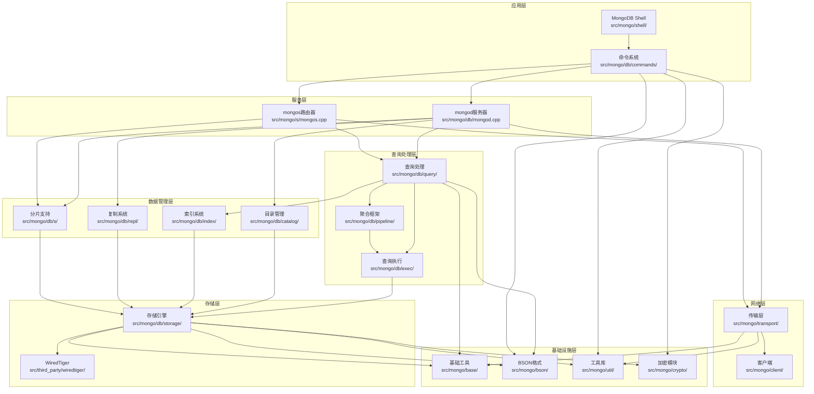

# MongoDB 模块架构分析

## 概述

本文档基于`src/mongo`目录的源码结构，详细分析MongoDB的核心模块架构，标注具体的源码位置，帮助开发者快速理解各模块的功能和相互关系。

## 核心模块架构

### 1. 基础设施层 (Infrastructure Layer)

#### 1.1 基础工具模块 (`src/mongo/base/`)
**核心功能**: 提供基础数据结构和工具类
- **错误处理**: `src/mongo/base/error_codes.yml` - 错误码定义
- **状态管理**: `src/mongo/base/status.h` - 状态和错误处理
- **字符串处理**: `src/mongo/base/string_data.h` - 高效字符串操作
- **初始化系统**: `src/mongo/base/initializer.h` - 模块初始化框架

#### 1.2 BSON数据格式模块 (`src/mongo/bson/`)
**核心功能**: MongoDB文档数据格式的完整实现
- **BSON对象**: `src/mongo/bson/bsonobj.h` - BSON文档核心类
- **BSON元素**: `src/mongo/bson/bsonelement.h` - BSON字段处理
- **BSON构建器**: `src/mongo/bson/bsonobjbuilder.h` - 文档构建工具
- **JSON转换**: `src/mongo/bson/json.h` - JSON与BSON互转
- **列式存储**: `src/mongo/bson/column/` - 列式BSON压缩格式

#### 1.3 工具库模块 (`src/mongo/util/`)
**核心功能**: 通用工具和系统级功能
- **并发控制**: `src/mongo/util/concurrency/` - 线程和锁管理
- **网络工具**: `src/mongo/util/net/` - 网络相关工具
- **时间处理**: `src/mongo/util/time_support.h` - 时间和定时器
- **内存管理**: `src/mongo/util/allocator.h` - 内存分配器
- **失败点**: `src/mongo/util/fail_point.h` - 测试和调试工具

### 2. 网络传输层 (Transport Layer)

#### 2.1 传输层模块 (`src/mongo/transport/`)
**核心功能**: 网络通信和会话管理
- **传输层接口**: `src/mongo/transport/transport_layer.h` - 传输层抽象
- **会话管理**: `src/mongo/transport/session.h` - 客户端会话
- **ASIO实现**: `src/mongo/transport/asio/` - 异步网络IO
- **gRPC支持**: `src/mongo/transport/grpc/` - gRPC传输实现
- **消息压缩**: `src/mongo/transport/message_compressor_*.h` - 消息压缩

### 3. 客户端连接层 (Client Layer)

#### 3.1 客户端模块 (`src/mongo/client/`)
**核心功能**: 客户端连接和驱动程序支持
- **数据库客户端**: `src/mongo/client/dbclient_base.h` - 客户端基类
- **连接管理**: `src/mongo/client/dbclient_connection.h` - 连接实现
- **复制集客户端**: `src/mongo/client/dbclient_rs.h` - 复制集连接
- **认证机制**: `src/mongo/client/authenticate.h` - 客户端认证
- **连接池**: `src/mongo/client/connpool.h` - 连接池管理

### 4. 数据库核心层 (Database Core Layer)

#### 4.1 数据库主模块 (`src/mongo/db/`)
**核心功能**: 数据库服务器的核心实现

##### 4.1.1 服务器入口
- **mongod主程序**: `src/mongo/db/mongod.cpp` - 数据库服务器入口
- **服务上下文**: `src/mongo/db/service_context.h` - 全局服务管理
- **操作上下文**: `src/mongo/db/operation_context.h` - 操作执行上下文

##### 4.1.2 存储引擎层 (`src/mongo/db/storage/`)
**核心功能**: 存储引擎抽象和实现
- **存储引擎接口**: `src/mongo/db/storage/storage_engine.h` - 存储引擎抽象
- **存储引擎实现**: `src/mongo/db/storage/storage_engine_impl.h` - 具体实现
- **记录存储**: `src/mongo/db/storage/record_store.h` - 记录存储接口
- **排序数据接口**: `src/mongo/db/storage/sorted_data_interface.h` - 索引存储
- **KV引擎**: `src/mongo/db/storage/kv/` - 键值存储引擎

##### 4.1.3 目录管理 (`src/mongo/db/catalog/`)
**核心功能**: 数据库和集合元数据管理
- **集合目录**: `src/mongo/db/catalog/collection_catalog.h` - 集合元数据
- **数据库目录**: `src/mongo/db/catalog/database.h` - 数据库管理
- **索引目录**: `src/mongo/db/catalog/index_catalog.h` - 索引元数据
- **持久化目录**: `src/mongo/db/catalog/durable_catalog.h` - 持久化元数据

##### 4.1.4 查询处理 (`src/mongo/db/query/`)
**核心功能**: 查询解析、规划和执行
- **查询规划器**: `src/mongo/db/query/planner/` - 查询计划生成
- **查询执行**: `src/mongo/db/exec/` - 查询执行引擎
- **SBE引擎**: `src/mongo/db/exec/sbe/` - Slot-Based执行引擎
- **查询优化器**: `src/mongo/db/query/optimizer/` - 查询优化

##### 4.1.5 聚合框架 (`src/mongo/db/pipeline/`)
**核心功能**: 聚合管道处理
- **文档源**: `src/mongo/db/pipeline/document_source*.h` - 聚合阶段
- **管道执行**: `src/mongo/db/pipeline/pipeline.h` - 管道执行器
- **表达式处理**: `src/mongo/db/pipeline/expression*.h` - 表达式计算

##### 4.1.6 索引系统 (`src/mongo/db/index/`)
**核心功能**: 索引创建和管理
- **索引构建**: `src/mongo/db/index_builds/` - 索引构建流程
- **索引访问**: `src/mongo/db/index/index_access_method.h` - 索引访问
- **多键索引**: `src/mongo/db/index/multikey_paths.h` - 多键索引支持

##### 4.1.7 复制系统 (`src/mongo/db/repl/`)
**核心功能**: 复制集和主从复制
- **复制协调器**: `src/mongo/db/repl/replication_coordinator.h` - 复制管理
- **Oplog管理**: `src/mongo/db/repl/oplog.h` - 操作日志
- **选举管理**: `src/mongo/db/repl/election_reason.h` - 选举机制
- **复制执行器**: `src/mongo/db/repl/replication_executor.h` - 复制任务

##### 4.1.8 分片支持 (`src/mongo/db/s/`)
**核心功能**: 分片集群中的数据节点功能
- **分片状态**: `src/mongo/db/s/sharding_state.h` - 分片节点状态
- **块管理**: `src/mongo/db/s/chunk_manager.h` - 数据块管理
- **迁移管理**: `src/mongo/db/s/migration_*.h` - 数据迁移
- **分片操作**: `src/mongo/db/s/operation_sharding_state.h` - 分片操作状态

##### 4.1.9 命令系统 (`src/mongo/db/commands/`)
**核心功能**: 数据库命令实现
- **命令基类**: `src/mongo/db/commands.h` - 命令框架
- **查询命令**: `src/mongo/db/commands/query_cmd/` - 查询相关命令
- **管理命令**: `src/mongo/db/commands/dbcommands.cpp` - 数据库管理
- **用户管理**: `src/mongo/db/commands/user_management_commands.cpp` - 用户管理

##### 4.1.10 认证授权 (`src/mongo/db/auth/`)
**核心功能**: 安全认证和权限管理
- **认证管理器**: `src/mongo/db/auth/authorization_manager.h` - 权限管理
- **认证会话**: `src/mongo/db/auth/authorization_session.h` - 用户会话
- **权限检查**: `src/mongo/db/auth/auth_checks.h` - 权限验证
- **用户管理**: `src/mongo/db/auth/user.h` - 用户信息

### 5. 分片路由层 (Sharding Router Layer)

#### 5.1 mongos路由器 (`src/mongo/s/`)
**核心功能**: 分片集群查询路由
- **mongos主程序**: `src/mongo/s/mongos.cpp` - 路由器入口
- **路由角色**: `src/mongo/s/router_role.h` - 路由器角色管理
- **集群网格**: `src/mongo/s/grid.h` - 分片集群抽象

##### 5.1.1 查询路由 (`src/mongo/s/query/`)
**核心功能**: 分片查询处理
- **集群查询**: `src/mongo/s/query/cluster_*.h` - 集群查询执行
- **异步结果合并**: `src/mongo/s/query/async_results_merger.h` - 结果合并
- **路由执行阶段**: `src/mongo/s/query/exec/` - 路由执行引擎

##### 5.1.2 分片管理
- **分片注册**: `src/mongo/s/shard_registry.h` - 分片注册表
- **分片键模式**: `src/mongo/s/shard_key_pattern.h` - 分片键处理
- **块版本**: `src/mongo/s/chunk_version.h` - 数据块版本管理
- **路由信息缓存**: `src/mongo/s/routing_information_cache.h` - 路由缓存

##### 5.1.3 命令路由 (`src/mongo/s/commands/`)
**核心功能**: 分片命令处理
- **集群命令**: `src/mongo/s/commands/cluster_*.cpp` - 分片集群命令
- **分片命令**: `src/mongo/s/commands/shardsvr_*.cpp` - 分片服务器命令

### 6. 脚本引擎层 (Scripting Layer)

#### 6.1 脚本支持 (`src/mongo/scripting/`)
**核心功能**: JavaScript脚本执行
- **脚本引擎**: `src/mongo/scripting/engine.h` - 脚本引擎接口
- **MozJS引擎**: `src/mongo/scripting/mozjs/` - Mozilla JavaScript引擎

#### 6.2 MongoDB Shell (`src/mongo/shell/`)
**核心功能**: 交互式命令行工具
- **Shell主程序**: `src/mongo/shell/mongo.cpp` - Shell入口
- **Shell工具**: `src/mongo/shell/shell_utils.h` - Shell工具函数

### 7. 加密和安全层 (Crypto Layer)

#### 7.1 加密模块 (`src/mongo/crypto/`)
**核心功能**: 加密和安全功能
- **字段级加密**: `src/mongo/crypto/fle_*.h` - 客户端字段级加密
- **JWT支持**: `src/mongo/crypto/jwt_*.h` - JWT令牌处理
- **哈希算法**: `src/mongo/crypto/sha*_block.h` - 哈希算法实现

## 模块间依赖关系

## 关键文件位置索引

### 核心入口文件
- **mongod服务器**: `src/mongo/db/mongod.cpp`
- **mongos路由器**: `src/mongo/s/mongos.cpp`
- **MongoDB Shell**: `src/mongo/shell/mongo.cpp`

### 核心接口定义
- **存储引擎接口**: `src/mongo/db/storage/storage_engine.h`
- **记录存储接口**: `src/mongo/db/storage/record_store.h`
- **命令基类**: `src/mongo/db/commands.h`
- **BSON核心类**: `src/mongo/bson/bsonobj.h`

### 关键实现文件
- **查询规划器**: `src/mongo/db/query/planner/`
- **聚合框架**: `src/mongo/db/pipeline/`
- **复制协调器**: `src/mongo/db/repl/replication_coordinator.h`
- **分片状态**: `src/mongo/db/s/sharding_state.h`

这个架构图展示了MongoDB的完整模块结构，每个模块都标注了具体的源码位置，便于开发者快速定位和理解相关代码。
