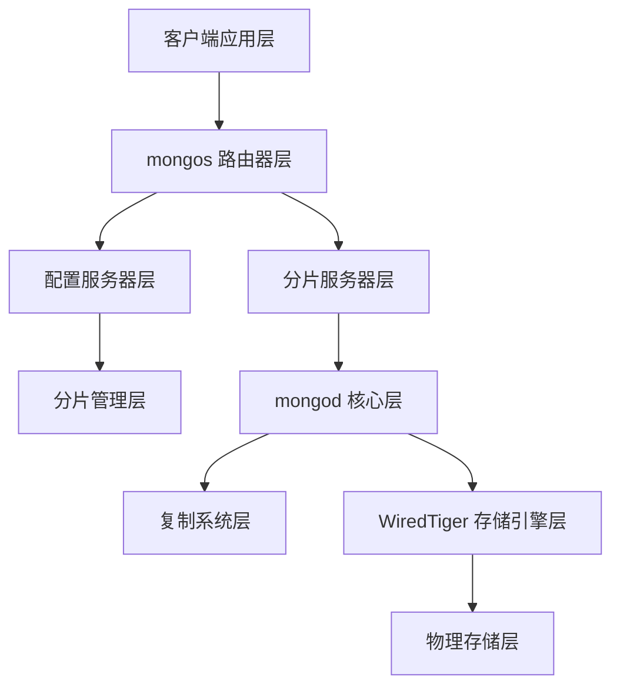

# MongoDB 项目架构总览

## 项目架构图表

本项目已创建了完整的 MongoDB 架构分析，包含以下 PlantUML 架构图：

### 1. 完整项目架构图
**文件**: `mongodb_complete_project_architecture.puml`
- 展示了从客户端到存储引擎的完整架构层次
- 包含详细的源码路径映射
- 涵盖所有核心组件和连接关系

### 2. 项目架构总结图
**文件**: `mongodb_project_architecture_summary.puml`
- 简化版的架构概览
- 突出核心模块和关键特性
- 适合高层次的架构理解

### 3. 整体架构图
**文件**: `mongodb_overall_architecture.puml`
- 分片集群的整体架构视图
- 展示各组件间的数据流和控制流
- 包含详细的组件说明

## 核心架构层次

### 架构分层

### 源码目录结构

| 架构层 | 源码路径 | 核心组件 |
|--------|----------|----------|
| **mongos 路由器** | `src/mongo/s/` | ServiceEntryPointRouterRole, Grid, CollectionRoutingInfoTargeter |
| **配置服务器** | `src/mongo/db/s/config/` | ShardingCatalogManager, ShardingInitializationMongoD |
| **分片管理** | `src/mongo/db/s/balancer/` | Balancer, MigrationSourceManager, ShardKeyPattern |
| **查询处理** | `src/mongo/db/query/` | QueryPlanner, PlanExecutor, PlanCache |
| **复制系统** | `src/mongo/db/repl/` | ReplicationCoordinator, OplogManager |
| **存储引擎** | `src/mongo/db/storage/wiredtiger/` | WiredTigerKVEngine, WiredTigerRecordStore |
| **命令处理** | `src/mongo/db/commands/` | CommandRegistry, BasicCommand |
| **网络传输** | `src/mongo/transport/` | TransportLayer, ServiceEntryPoint |

## 关键设计特性

### 1. 分布式架构
- **水平扩展**: 支持动态添加分片和路由器
- **无单点故障**: 所有组件都支持集群部署
- **负载均衡**: 自动数据分布和查询负载均衡

### 2. 数据一致性
- **MVCC**: WiredTiger 提供多版本并发控制
- **复制集**: 数据自动复制到多个节点
- **事务支持**: 支持 ACID 事务保证

### 3. 性能优化
- **多级缓存**: 从应用到存储引擎的多级缓存
- **查询优化**: 智能查询规划和执行
- **并发处理**: 文档级并发和异步处理

### 4. 运维友好
- **自动化管理**: 自动负载均衡和故障转移
- **监控支持**: 丰富的监控指标和工具
- **在线扩展**: 支持在线添加分片和配置变更

## 数据流向

### 查询流程
1. **客户端** → **mongos路由器** → **分片服务器** → **存储引擎**
2. 路由器根据分片键确定目标分片
3. 并行查询多个分片并合并结果
4. 返回最终结果给客户端

### 写入流程
1. **客户端** → **mongos路由器** → **主分片**
2. 路由器确定写入的目标分片
3. 主分片执行写入操作
4. 复制到从分片节点

### 管理流程
1. **配置服务器** → **负载均衡器** → **数据迁移**
2. 监控集群负载状态
3. 触发数据块迁移
4. 更新元数据信息

## 使用建议

### 查看架构图
1. 使用支持 PlantUML 的工具打开 `.puml` 文件
2. 推荐工具：
   - VS Code + PlantUML 插件
   - IntelliJ IDEA + PlantUML 插件
   - 在线 PlantUML 编辑器

### 深入学习
1. 从 `mongodb_project_architecture_summary.puml` 开始了解整体架构
2. 查看各模块的详细分析文档：
   - `mongos_router_module_analysis.md`
   - `config_server_module_analysis.md`
   - `wiredtiger_storage_engine_analysis.md`
   - `sharding_management_module_analysis.md`
3. 结合源码阅读架构图中的组件实现

### 架构扩展
- 可以基于现有架构图添加新的模块分析
- 支持自定义颜色和样式
- 可以创建特定场景的架构视图

## 总结

MongoDB 项目采用了现代分布式数据库的先进架构设计，通过分层架构、微服务思想和模块化设计，实现了高可用、高性能和高扩展性的目标。本架构分析提供了从宏观到微观的完整视图，有助于深入理解 MongoDB 的设计思想和实现细节。
