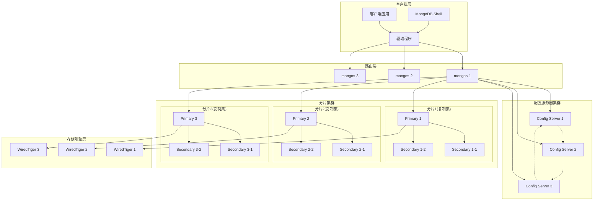
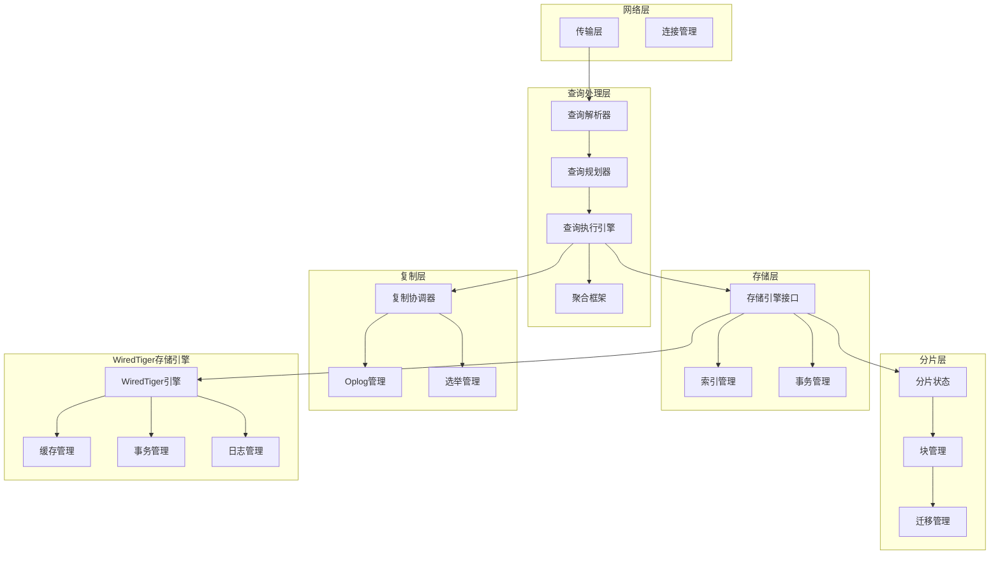

# MongoDB 项目架构分析

## 项目概述

MongoDB是一个开源的文档型数据库系统，采用C++编写，支持分布式架构、复制集和分片功能。本项目是MongoDB数据库服务器的完整实现，包含了数据库引擎、查询处理、存储管理、网络通信等核心组件。

## 核心特性

- **JSON数据模型**：支持动态模式的文档存储
- **自动分片**：水平扩展能力
- **内置复制**：高可用性保障
- **丰富的索引**：包括地理空间索引、TTL索引、文本搜索
- **聚合框架**：强大的数据处理能力
- **原生MapReduce**：分布式数据处理

## 主要组件

### 1. 核心服务器组件

#### mongod - 数据库服务器
- **位置**: `src/mongo/db/mongod.cpp`
- **功能**: 主要的数据库守护进程，处理数据请求、管理数据访问、执行后台管理操作
- **角色**: 在分片集群中作为分片服务器，在复制集中作为主节点或从节点

#### mongos - 分片路由器  
- **位置**: `src/mongo/s/mongos.cpp`
- **功能**: 分片集群查询路由器，负责将客户端请求路由到正确的分片
- **特点**: 无状态服务，可以部署多个实例实现负载均衡

### 2. 存储引擎架构

#### WiredTiger存储引擎
- **位置**: `src/third_party/wiredtiger/`
- **特性**: 
  - 文档级并发控制
  - 压缩存储
  - 检查点机制
  - 事务支持
- **配置**: 支持多种存储配置选项，但不支持LSM树类型

#### 存储引擎集成层
- **位置**: `src/mongo/db/storage/`
- **功能**: 
  - 存储引擎抽象接口
  - 记录ID管理
  - 服务器恢复机制
  - 存储统计信息

### 3. 查询处理系统

#### 查询引擎
- **经典引擎**: 传统的查询执行引擎
- **SBE引擎**: Slot-Based Execution引擎，新一代查询执行引擎
- **混合模式**: 支持两种引擎的混合使用

#### 查询规划器
- **位置**: `src/mongo/s/query/planner/`
- **功能**: 
  - 查询计划生成
  - 分片目标选择
  - 查询优化

#### 聚合框架
- **位置**: `src/mongo/db/pipeline/`
- **功能**: 
  - 管道式数据处理
  - 多阶段聚合操作
  - 分布式聚合支持

### 4. 复制系统

#### 复制集管理
- **位置**: `src/mongo/db/repl/`
- **功能**:
  - 主从复制
  - 选举机制
  - Oplog管理
  - 读关注和写关注

#### 复制状态管理
- **功能**: 
  - 节点状态跟踪
  - 复制延迟监控
  - 故障转移处理

### 5. 分片系统

#### 路由层
- **位置**: `src/mongo/s/router_role.cpp`
- **组件**:
  - `DBPrimaryRouter`: 数据库级DDL操作路由
  - `CollectionRouter`: 集合级CRUD操作路由
  - `MultiCollectionRouter`: 多集合操作路由

#### 分片管理
- **位置**: `src/mongo/db/s/`
- **功能**:
  - 分片键管理
  - 块迁移
  - 负载均衡
  - 分片状态监控

### 6. 索引系统

#### 索引类型支持
- B树索引
- 地理空间索引
- 文本搜索索引
- TTL索引
- 复合索引

#### 索引限制
- 每个集合最多64个索引
- 每个集合最多1个文本索引

## 项目结构分析

```
src/mongo/
├── base/           # 基础工具和数据结构
├── bson/           # BSON数据格式处理
├── client/         # 客户端连接管理
├── db/             # 数据库核心功能
│   ├── repl/       # 复制系统
│   ├── s/          # 分片相关功能
│   ├── storage/    # 存储引擎接口
│   └── commands/   # 数据库命令实现
├── s/              # mongos路由器实现
├── shell/          # MongoDB Shell
├── transport/      # 网络传输层
└── util/           # 通用工具库
```

## 构建系统

### Bazel构建系统
- **构建工具**: 使用Google Bazel作为主要构建系统
- **Python支持**: 需要Python 3.10+
- **编译器要求**: 
  - GCC 14.2+
  - Clang 19.1+
  - Visual Studio 2022 17.0+

### 主要构建目标
- `install-mongod`: 构建数据库服务器
- `install-mongos`: 构建分片路由器
- `install-core`: 构建核心组件
- `install-dist`: 构建完整发行版
- `install-devcore`: 构建开发版本

## 测试框架

### 测试类型
- **单元测试**: C++单元测试
- **集成测试**: JavaScript测试套件
- **性能测试**: 基准测试和性能回归测试
- **分片测试**: 分布式功能测试

### 测试工具
- **resmoke.py**: 主要的测试运行器
- **jstests/**: JavaScript测试用例集合
- **dbtests/**: C++数据库测试

## 第三方依赖

### 主要依赖库
- **WiredTiger**: 存储引擎
- **Boost**: C++库集合
- **OpenSSL**: 加密和SSL/TLS支持
- **PCRE2**: 正则表达式支持
- **zlib/zstandard**: 数据压缩
- **gRPC**: RPC通信框架

## 开发和部署

### 开发环境
- 支持Linux、macOS、Windows平台
- 需要约13GB磁盘空间用于核心二进制文件
- 完整构建需要约600GB磁盘空间

### 配置管理
- **mongod.conf**: 数据库服务器配置
- **命令行参数**: 丰富的启动参数支持
- **运行时参数**: 动态配置调整

## 许可证

- **SSPL v1**: 2018年10月16日后的版本使用Server Side Public License
- **AGPL**: 2018年10月16日前的版本使用AGPL许可证

## 核心架构图



## mongod内部架构



这些架构图展示了MongoDB的分布式特性和内部组件结构，包括分片、复制、路由和存储等核心概念的实现。
