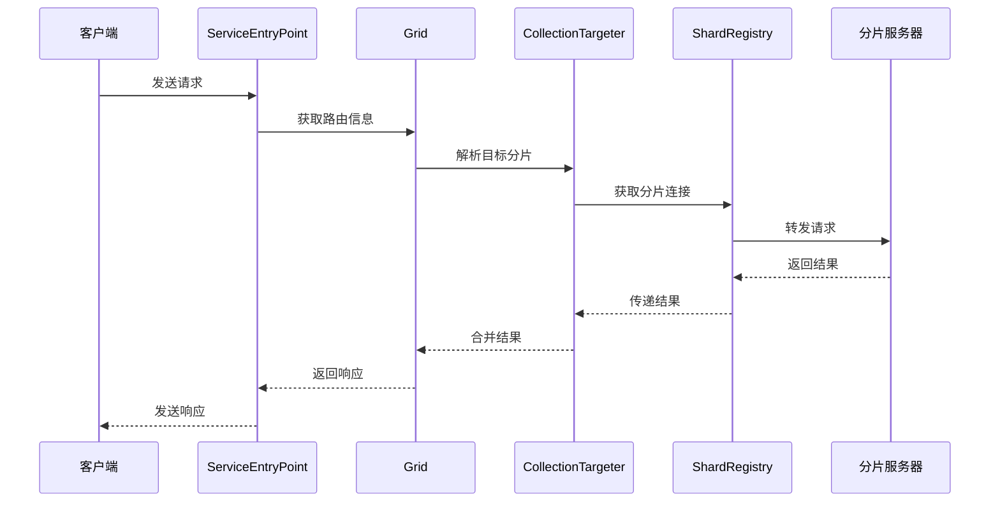

# mongos 路由器模块深度分析

## 概述

mongos 是 MongoDB 分片集群的查询路由器，作为客户端和分片服务器之间的中间层，负责接收客户端请求、解析查询条件、确定目标分片并路由请求。本文档深入分析 mongos 路由器模块的架构设计和实现细节。

## 架构设计思路

### 核心设计原则

1. **无状态设计**：mongos 不存储任何持久化数据，所有路由信息从配置服务器获取
2. **水平扩展**：可以部署多个 mongos 实例实现负载均衡
3. **缓存机制**：本地缓存路由信息以提高性能
4. **错误重试**：内置重试机制处理网络异常和分片故障

### 模块组织结构

```
src/mongo/s/
├── service_entry_point_router_role.cpp    # 服务入口点
├── grid.cpp                               # 分片集群抽象
├── router_role.cpp                        # 路由角色管理
├── collection_routing_info_targeter.cpp   # 集合路由目标选择
├── client/shard_registry.cpp              # 分片注册表
└── query/                                 # 查询路由处理
```

## 核心组件实现

### 1. 服务入口点 (ServiceEntryPointRouterRole)

**源码位置**: `src/mongo/s/service_entry_point_router_role.cpp`

服务入口点是 mongos 处理客户端请求的第一层，负责验证集群角色并分发请求。

<augment_code_snippet path="src/mongo/s/service_entry_point_router_role.cpp" mode="EXCERPT">
````cpp
Future<DbResponse> ServiceEntryPointRouterRole::handleRequest(OperationContext* opCtx,
                                                              const Message& message) {
    tassert(9391502,
            "Invalid ClusterRole in ServiceEntryPointRouterRole",
            opCtx->getService()->role().hasExclusively(ClusterRole::RouterServer));
    return handleRequestImpl(opCtx, message);
}
````
</augment_code_snippet>

**设计要点**：
- 严格验证集群角色，确保只有路由器角色才能处理请求
- 使用 Future 异步处理模式，提高并发性能
- 委托给 `handleRequestImpl` 进行具体的请求处理

### 2. 分片集群抽象 (Grid)

**源码位置**: `src/mongo/s/grid.cpp`

Grid 是分片集群的核心抽象，管理所有分片相关的服务组件。

<augment_code_snippet path="src/mongo/s/grid.cpp" mode="EXCERPT">
````cpp
void Grid::init(std::unique_ptr<ShardingCatalogClient> catalogClient,
                std::unique_ptr<CatalogCache> catalogCache,
                std::shared_ptr<ShardRegistry> shardRegistry,
                std::unique_ptr<ClusterCursorManager> cursorManager,
                std::unique_ptr<BalancerConfiguration> balancerConfig,
                std::unique_ptr<executor::TaskExecutorPool> executorPool,
                executor::NetworkInterface* network) {
    _catalogClient = std::move(catalogClient);
    _catalogCache = std::move(catalogCache);
    _shardRegistry = std::move(shardRegistry);
    _cursorManager = std::move(cursorManager);
    _balancerConfig = std::move(balancerConfig);
    _executorPool = std::move(executorPool);
    _network = network;
    
    _shardRegistry->init();
    _isGridInitialized.store(true);
}
````
</augment_code_snippet>

**核心组件**：
- **CatalogClient**: 配置服务器客户端，获取元数据
- **CatalogCache**: 本地缓存，存储路由信息
- **ShardRegistry**: 分片注册表，管理分片连接
- **ClusterCursorManager**: 集群游标管理器
- **TaskExecutorPool**: 任务执行器池

### 3. 路由目标选择 (CollectionRoutingInfoTargeter)

**源码位置**: `src/mongo/s/collection_routing_info_targeter.cpp`

负责根据查询条件确定目标分片，是路由决策的核心组件。

<augment_code_snippet path="src/mongo/s/collection_routing_info_targeter.cpp" mode="EXCERPT">
````cpp
StatusWith<std::vector<ShardEndpoint>> CollectionRoutingInfoTargeter::_targetQuery(
    const CanonicalQuery& query) const {
    
    std::set<ShardId> shardIds;
    try {
        getShardIdsForCanonicalQuery(query, _cri.getChunkManager(), &shardIds);
    } catch (const DBException& ex) {
        return ex.toStatus();
    }
    
    std::vector<ShardEndpoint> endpoints;
    for (auto&& shardId : shardIds) {
        ShardVersion shardVersion = _cri.getShardVersion(shardId);
        endpoints.emplace_back(std::move(shardId), std::move(shardVersion), boost::none);
    }
    
    return endpoints;
}
````
</augment_code_snippet>

**路由策略**：
- **分片键匹配**: 根据查询条件中的分片键确定目标分片
- **范围查询**: 对于范围查询，可能需要访问多个分片
- **广播查询**: 没有分片键的查询需要广播到所有分片

### 4. 分片注册表 (ShardRegistry)

**源码位置**: `src/mongo/s/client/shard_registry.cpp`

管理集群中所有分片的连接信息和状态。

<augment_code_snippet path="src/mongo/s/client/shard_registry.cpp" mode="EXCERPT">
````cpp
SemiFuture<std::shared_ptr<Shard>> ShardRegistry::getShard(ExecutorPtr executor,
                                                           const ShardId& shardId) noexcept {
    return _getDataAsync()
        .thenRunOn(executor)
        .then([this, executor, shardId](auto&& cachedData) {
            if (auto shard = cachedData->findShard(shardId)) {
                return SemiFuture<std::shared_ptr<Shard>>::makeReady(std::move(shard));
            }
            
            stdx::lock_guard<stdx::mutex> lk(_mutex);
            if (auto shard = _configShardData.findShard(shardId)) {
                return SemiFuture<std::shared_ptr<Shard>>::makeReady(std::move(shard));
            }
            // ... 处理未找到分片的情况
        });
}
````
</augment_code_snippet>

**功能特性**：
- **异步获取**: 使用 SemiFuture 异步获取分片连接
- **缓存机制**: 本地缓存分片信息，减少配置服务器访问
- **连接池**: 管理到各分片的连接池

## 请求处理流程



## 性能优化机制

### 1. 缓存策略
- **路由信息缓存**: 本地缓存集合的分片信息
- **连接池**: 复用到分片的网络连接
- **查询计划缓存**: 缓存常用查询的执行计划

### 2. 并发处理
- **异步 I/O**: 使用 Future/Promise 模式处理异步操作
- **线程池**: 使用专门的线程池处理网络请求
- **无锁设计**: 尽量减少锁的使用，提高并发性能

### 3. 错误处理
- **自动重试**: 网络错误和临时故障自动重试
- **故障转移**: 分片不可用时自动切换到其他副本
- **版本控制**: 使用版本号确保路由信息的一致性

## 关键设计模式

### 1. 策略模式
不同类型的操作使用不同的路由策略：
- **插入操作**: 根据分片键直接路由到目标分片
- **查询操作**: 根据查询条件确定需要访问的分片
- **更新操作**: 可能需要多分片协调

### 2. 工厂模式
使用工厂模式创建各种组件：
- **ShardFactory**: 创建分片连接对象
- **TargeterFactory**: 创建路由目标选择器

### 3. 观察者模式
监听配置变更并更新本地缓存：
- **配置变更通知**: 监听配置服务器的变更
- **缓存失效**: 及时更新过期的路由信息

## 总结

mongos 路由器模块通过精心设计的架构实现了高性能、高可用的分片集群路由功能。其无状态设计使得系统具有良好的水平扩展能力，而缓存机制和异步处理则保证了优秀的性能表现。通过深入理解这些设计思路和实现细节，可以更好地使用和优化 MongoDB 分片集群。
