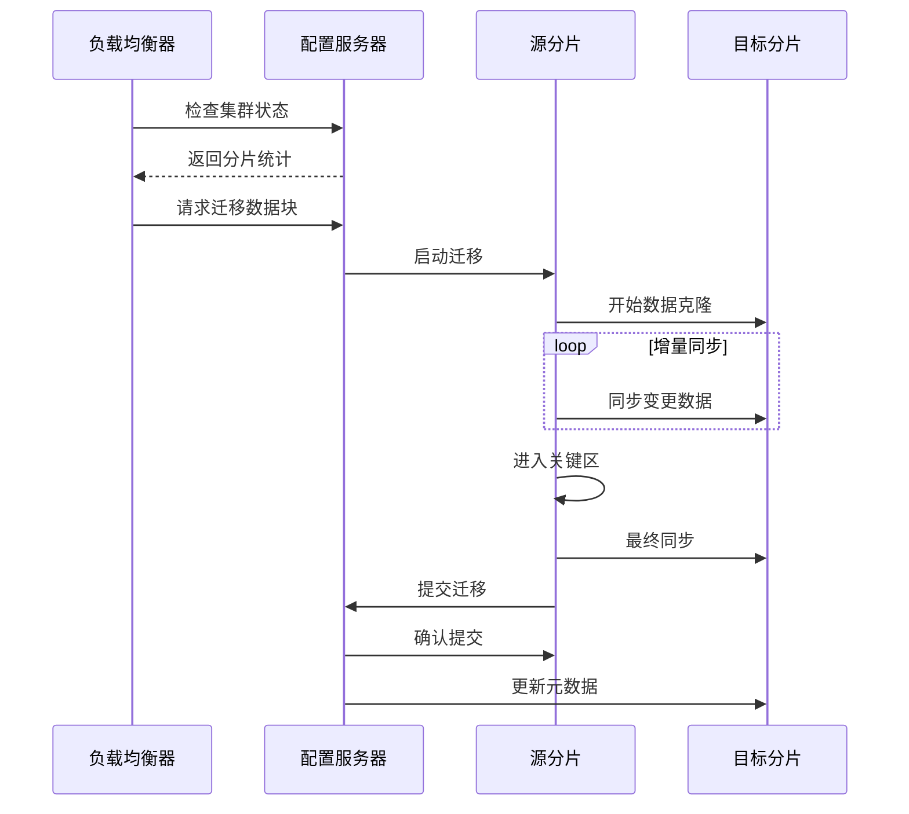

# 分片管理模块深度分析

## 概述

分片管理模块是 MongoDB 分片集群的核心组件，负责数据的分布、负载均衡、数据迁移和分片键管理等功能。本文档深入分析分片管理模块的架构设计和实现细节。

## 架构设计思路

### 核心设计原则

1. **自动负载均衡**：自动监控分片负载并触发数据迁移
2. **透明数据分布**：应用程序无需关心数据在哪个分片上
3. **水平扩展**：支持动态添加和删除分片
4. **数据一致性**：确保迁移过程中的数据一致性

### 模块组织结构

```
src/mongo/s/
├── shard_key_pattern.cpp                 # 分片键模式
├── balancer/
│   ├── balancer.cpp                      # 负载均衡器
│   ├── balancer_chunk_selection_policy.cpp  # 数据块选择策略
│   └── balancer_commands_scheduler.cpp   # 命令调度器
└── db/s/
    ├── config/initial_split_policy.cpp   # 初始分片策略
    ├── migration_source_manager.cpp      # 迁移源管理器
    └── migration_destination_manager.cpp # 迁移目标管理器
```

## 核心组件实现

### 1. 分片键模式 (ShardKeyPattern)

**源码位置**: `src/mongo/s/shard_key_pattern.cpp`

分片键模式定义了数据如何在分片间分布，是分片系统的基础。

<augment_code_snippet path="src/mongo/s/shard_key_pattern.cpp" mode="EXCERPT">
````cpp
BSONObj ShardKeyPattern::extractShardKeyFromDoc(const BSONObj& doc) const {
    BSONObjBuilder keyBuilder;
    for (auto&& patternEl : _keyPattern.toBSON()) {
        BSONElement matchEl = extractKeyElementFromDoc(doc, patternEl.fieldNameStringData());
        
        if (matchEl.eoo()) {
            matchEl = kNullObj.firstElement();
        }
        
        if (!isValidShardKeyElementForExtractionFromDocument(matchEl)) {
            return BSONObj();
        }
        
        if (isHashedPatternEl(patternEl)) {
            keyBuilder.append(
                patternEl.fieldName(),
                BSONElementHasher::hash64(matchEl, BSONElementHasher::DEFAULT_HASH_SEED));
        } else {
            keyBuilder.appendAs(matchEl, patternEl.fieldName());
        }
    }
    return keyBuilder.obj();
}
````
</augment_code_snippet>

**分片键类型**：
- **范围分片**: 基于分片键值的范围分布数据
- **哈希分片**: 使用哈希函数均匀分布数据
- **复合分片键**: 支持多字段组合的分片键

### 2. 初始分片策略 (InitialSplitPolicy)

**源码位置**: `src/mongo/db/s/config/initial_split_policy.cpp`

初始分片策略决定了新分片集合的初始数据块分布。

<augment_code_snippet path="src/mongo/db/s/config/initial_split_policy.cpp" mode="EXCERPT">
````cpp
InitialSplitPolicy::ShardCollectionConfig SingleChunkOnShardSplitPolicy::createFirstChunks(
    OperationContext* opCtx,
    const ShardKeyPattern& shardKeyPattern,
    const SplitPolicyParams& params) {
    const auto currentTime = VectorClock::get(opCtx)->getTime();
    const auto validAfter = currentTime.clusterTime().asTimestamp();
    
    ChunkVersion version({OID::gen(), validAfter}, {1, 0});
    const auto& keyPattern = shardKeyPattern.getKeyPattern();
    std::vector<ChunkType> chunks;
    appendChunk(
        params, keyPattern.globalMin(), keyPattern.globalMax(), &version, _dataShard, &chunks);
    
    return {std::move(chunks)};
}
````
</augment_code_snippet>

**分片策略类型**：
- **单块策略**: 创建单个数据块在指定分片上
- **预分割策略**: 根据分片键预先创建多个数据块
- **采样策略**: 基于现有数据采样创建合理的分割点

### 3. 负载均衡器 (Balancer)

**源码位置**: `src/mongo/db/s/balancer/balancer.cpp`

负载均衡器是分片集群的自动化管理核心，负责监控和调整数据分布。

<augment_code_snippet path="src/mongo/db/s/balancer/balancer.cpp" mode="EXCERPT">
````cpp
Balancer::Balancer()
    : _balancedLastTime({}),
      _clusterStats(std::make_unique<ClusterStatisticsImpl>()),
      _chunkSelectionPolicy(std::make_unique<BalancerChunkSelectionPolicy>(_clusterStats.get())),
      _commandScheduler(std::make_unique<BalancerCommandsSchedulerImpl>()),
      _defragmentationPolicy(std::make_unique<BalancerDefragmentationPolicy>(
          _clusterStats.get(), [this]() { _onActionsStreamPolicyStateUpdate(); })),
      _autoMergerPolicy(
          std::make_unique<AutoMergerPolicy>([this]() { _onActionsStreamPolicyStateUpdate(); })),
      _moveUnshardedPolicy(std::make_unique<MoveUnshardedPolicy>()) {}
````
</augment_code_snippet>

**均衡策略**：
- **数据块选择**: 选择需要迁移的数据块
- **目标分片选择**: 选择迁移的目标分片
- **碎片整理**: 合并小的数据块减少碎片
- **自动合并**: 自动合并相邻的小数据块

### 4. 迁移源管理器 (MigrationSourceManager)

**源码位置**: `src/mongo/db/s/migration_source_manager.cpp`

迁移源管理器负责管理数据块迁移的源端操作。

<augment_code_snippet path="src/mongo/db/s/migration_source_manager.cpp" mode="EXCERPT">
````cpp
MigrationSourceManager MigrationSourceManager::createMigrationSourceManager(
    OperationContext* opCtx,
    ShardsvrMoveRange&& request,
    WriteConcernOptions&& writeConcern,
    ConnectionString donorConnStr,
    HostAndPort recipientHost) {
    invariant(!shard_role_details::getLocker(opCtx)->isLocked());
    
    auto&& args = std::move(request);
    const auto& nss = args.getCommandParameter();
    
    LOGV2(22016,
          "Starting chunk migration donation",
          "requestParameters"_attr = redact(args.toBSON()));
    
    // 确保获取最新的分片版本信息
    uassertStatusOK(FilteringMetadataCache::get(opCtx)->onCollectionPlacementVersionMismatch(
        opCtx, nss, boost::none));
}
````
</augment_code_snippet>

**迁移状态**：
- **Created**: 迁移管理器已创建
- **Cloning**: 正在克隆数据
- **CloneCaughtUp**: 克隆已追上
- **CriticalSection**: 进入关键区
- **CloneCompleted**: 克隆完成
- **CommittingOnConfig**: 在配置服务器上提交
- **Done**: 迁移完成

## 数据迁移流程

### 1. 迁移协议



### 2. 关键区机制

关键区是迁移过程中的重要概念，确保数据一致性：

- **阻塞写入**: 关键区内阻塞对迁移数据块的写入
- **最终同步**: 同步关键区前的所有变更
- **原子提交**: 原子性地更新元数据

### 3. 故障恢复

迁移过程中的故障恢复机制：

- **状态持久化**: 迁移状态持久化到配置服务器
- **自动重试**: 网络故障时自动重试
- **回滚机制**: 迁移失败时回滚到原始状态

## 负载均衡算法

### 1. 不平衡检测

负载均衡器使用多种指标检测集群不平衡：

```cpp
struct ShardStatistics {
    ShardId shardId;
    uint64_t maxSizeMB;          // 分片最大容量
    uint64_t currSizeMB;         // 当前使用容量
    bool isDraining;             // 是否正在排空
    std::set<std::string> tags;  // 分片标签
    long long numChunks;         // 数据块数量
};
```

### 2. 迁移决策

均衡器的迁移决策考虑多个因素：

- **数据块数量**: 分片间数据块数量差异
- **数据大小**: 分片间数据大小差异
- **分片标签**: 考虑分片的标签约束
- **迁移成本**: 评估迁移的网络和性能成本

### 3. 优化策略

- **批量迁移**: 同时进行多个数据块迁移
- **优先级排序**: 优先迁移大的数据块
- **时间窗口**: 在低峰时段进行迁移
- **带宽限制**: 限制迁移占用的网络带宽

## 分片键设计原则

### 1. 分片键选择

好的分片键应该具备以下特性：

- **高基数**: 分片键值的种类要足够多
- **低频率**: 避免热点数据集中在少数分片
- **非单调**: 避免所有新数据都写入同一分片
- **查询友好**: 常用查询应该包含分片键

### 2. 分片键类型

```javascript
// 范围分片键
{ userId: 1 }

// 哈希分片键  
{ userId: "hashed" }

// 复合分片键
{ country: 1, userId: 1 }

// 时间序列分片键
{ timestamp: 1, deviceId: 1 }
```

### 3. 分片键限制

- **不可变性**: 分片键值不能修改
- **索引要求**: 分片键必须是索引的前缀
- **大小限制**: 分片键值总大小不能超过 512 字节
- **类型限制**: 不支持数组类型的分片键

## 性能优化

### 1. 预分片

对于已知数据分布的场景，可以预先创建分片：

```javascript
// 预分片示例
sh.shardCollection("mydb.mycoll", { userId: 1 })
for (let i = 0; i < 100; i++) {
    sh.splitAt("mydb.mycoll", { userId: i * 1000 })
}
```

### 2. 区域分片

使用区域分片将相关数据放在同一分片：

```javascript
// 创建区域
sh.addShardTag("shard0001", "US")
sh.addShardTag("shard0002", "EU")

// 配置区域范围
sh.addTagRange("mydb.mycoll", 
    { country: "US", userId: MinKey }, 
    { country: "US", userId: MaxKey }, 
    "US")
```

### 3. 监控和调优

- **分片统计**: 监控各分片的数据量和查询负载
- **迁移监控**: 跟踪数据迁移的进度和性能
- **查询分析**: 分析查询模式优化分片键设计
- **性能指标**: 监控集群的整体性能指标

## 总结

分片管理模块通过精心设计的分片键模式、智能的负载均衡算法和可靠的数据迁移机制，为 MongoDB 提供了强大的水平扩展能力。其自动化的管理特性大大降低了分片集群的运维复杂度，而灵活的配置选项则允许根据不同的应用场景进行优化调整。深入理解这些机制有助于更好地设计和管理大规模的 MongoDB 分片集群。
