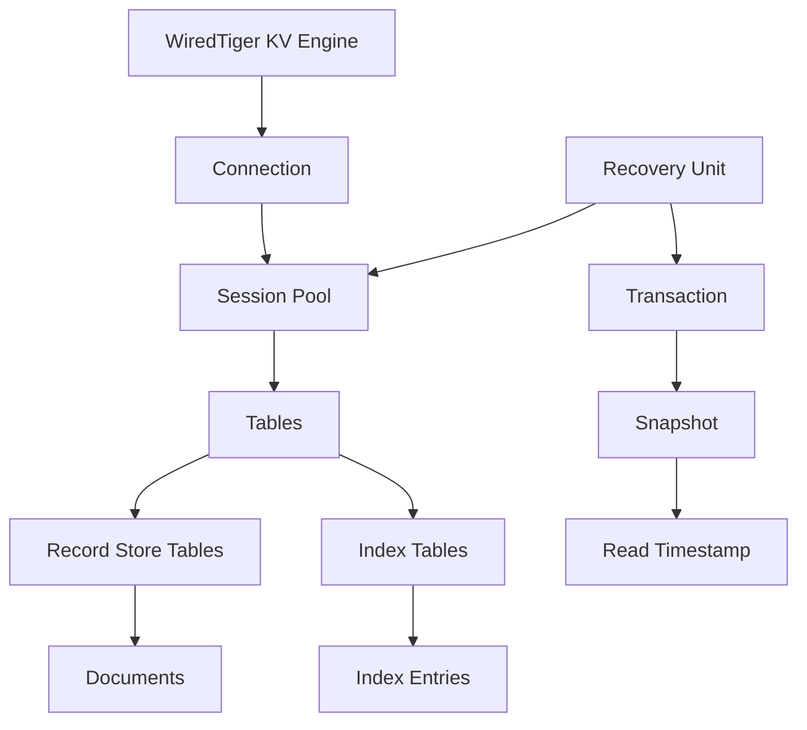
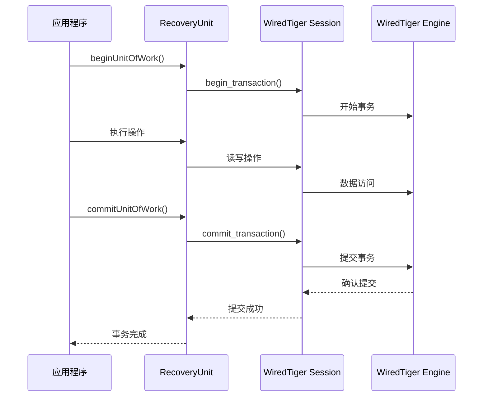

# WiredTiger 存储引擎模块深度分析

## 概述

WiredTiger 是 MongoDB 的默认存储引擎，提供文档级并发控制、数据压缩、检查点机制和事务支持等高级功能。本文档深入分析 WiredTiger 存储引擎模块的架构设计和实现细节。

## 架构设计思路

### 核心设计原则

1. **MVCC 多版本控制**：支持文档级并发，读写操作互不阻塞
2. **数据压缩**：内置多种压缩算法，节省存储空间
3. **检查点机制**：定期创建一致性快照，支持崩溃恢复
4. **事务支持**：提供 ACID 事务保证

### 模块组织结构

```
src/mongo/db/storage/wiredtiger/
├── wiredtiger_kv_engine.cpp              # KV引擎主实现
├── wiredtiger_record_store.cpp           # 记录存储实现
├── wiredtiger_index.cpp                  # 索引实现
├── wiredtiger_recovery_unit.cpp          # 恢复单元实现
├── wiredtiger_session_cache.cpp          # 会话缓存
└── wiredtiger_util.cpp                   # 工具函数
```

## 核心组件实现

### 1. WiredTiger KV 引擎 (WiredTigerKVEngine)

**源码位置**: `src/mongo/db/storage/wiredtiger/wiredtiger_kv_engine.cpp`

KV 引擎是 WiredTiger 存储引擎的核心组件，负责管理存储引擎的生命周期和配置。

<augment_code_snippet path="src/mongo/db/storage/wiredtiger/wiredtiger_kv_engine.cpp" mode="EXCERPT">
````cpp
WiredTigerKVEngine::WiredTigerKVEngine(const std::string& canonicalName,
                                       const std::string& path,
                                       ClockSource* clockSource,
                                       WiredTigerConfig wtConfig,
                                       bool repair,
                                       bool isReplSet,
                                       bool shouldRecoverFromOplogAsStandalone,
                                       bool inStandaloneMode)
    : WiredTigerKVEngineBase(canonicalName, path, clockSource, std::move(wtConfig)),
      _oplogManager(std::make_unique<WiredTigerOplogManager>()),
      _sizeStorerSyncTracker(clockSource,
                             gWiredTigerSizeStorerPeriodicSyncHits,
                             Milliseconds{gWiredTigerSizeStorerPeriodicSyncPeriodMillis}),
      _inRepairMode(repair),
      _isReplSet(isReplSet) {
    _pinnedOplogTimestamp.store(Timestamp::max().asULL());
}
````
</augment_code_snippet>

**核心功能**：
- **连接管理**: 管理到 WiredTiger 数据库的连接
- **表创建**: 创建和管理数据表和索引表
- **检查点**: 协调检查点创建和管理
- **恢复单元**: 创建事务恢复单元

### 2. 记录存储 (WiredTigerRecordStore)

**源码位置**: `src/mongo/db/storage/wiredtiger/wiredtiger_record_store.cpp`

记录存储负责文档数据的存储和检索，支持不同类型的集合（普通集合、固定集合、oplog）。

<augment_code_snippet path="src/mongo/db/storage/wiredtiger/wiredtiger_record_store.cpp" mode="EXCERPT">
````cpp
WiredTigerRecordStore::WiredTigerRecordStore(WiredTigerKVEngineBase* kvEngine,
                                             WiredTigerRecoveryUnit& ru,
                                             Params params)
    : RecordStoreBase(params.uuid, params.ident),
      _uri(WiredTigerUtil::kTableUriPrefix + params.ident),
      _tableId(WiredTigerUtil::genTableId()),
      _engineName(params.engineName),
      _keyFormat(params.keyFormat),
      _overwrite(params.overwrite),
      _isLogged(params.isLogged),
      _forceUpdateWithFullDocument(params.forceUpdateWithFullDocument),
      _inMemory(params.inMemory),
      _sizeStorer(params.sizeStorer),
      _tracksSizeAdjustments(params.tracksSizeAdjustments),
      _kvEngine(kvEngine) {
    invariant(getIdent().size() > 0);
}
````
</augment_code_snippet>

**存储类型**：
- **标准记录存储**: 普通集合的文档存储
- **固定集合**: 支持固定大小的循环集合
- **Oplog**: 专门优化的操作日志存储

### 3. 索引实现 (WiredTigerIndex)

**源码位置**: `src/mongo/db/storage/wiredtiger/wiredtiger_index.cpp`

索引实现提供高效的数据检索能力，支持多种索引类型。

<augment_code_snippet path="src/mongo/db/storage/wiredtiger/wiredtiger_index.cpp" mode="EXCERPT">
````cpp
std::variant<Status, SortedDataInterface::DuplicateKey> WiredTigerIndex::insert(
    OperationContext* opCtx,
    RecoveryUnit& ru,
    const key_string::View& keyString,
    bool dupsAllowed,
    IncludeDuplicateRecordId includeDuplicateRecordId) {
    dassertRecordIdAtEnd(keyString, _rsKeyFormat);
    
    auto& wtRu = WiredTigerRecoveryUnit::get(ru);
    auto cursorParams = getWiredTigerCursorParams(wtRu, _tableId);
    WiredTigerCursor curwrap(std::move(cursorParams), _uri, *wtRu.getSession());
    wtRu.assertInActiveTxn();
    WT_CURSOR* c = curwrap.get();
    
    return _insert(
        opCtx, ru, c, curwrap.getSession(), keyString, dupsAllowed, includeDuplicateRecordId);
}
````
</augment_code_snippet>

**索引特性**：
- **B+ 树结构**: 使用 B+ 树实现高效的范围查询
- **唯一性约束**: 支持唯一索引和重复键检测
- **部分索引**: 支持条件索引和稀疏索引

### 4. 恢复单元 (WiredTigerRecoveryUnit)

**源码位置**: `src/mongo/db/storage/wiredtiger/wiredtiger_recovery_unit.cpp`

恢复单元是事务管理的核心，负责事务的开始、提交、回滚和快照管理。

<augment_code_snippet path="src/mongo/db/storage/wiredtiger/wiredtiger_recovery_unit.h" mode="EXCERPT">
````cpp
class WiredTigerRecoveryUnit final : public RecoveryUnit {
public:
    void prepareUnitOfWork() override;
    void preallocateSnapshot(
        const OpenSnapshotOptions& options = kDefaultOpenSnapshotOptions) override;
    Status majorityCommittedSnapshotAvailable() const override;
    boost::optional<Timestamp> getPointInTimeReadTimestamp() override;
    Status setTimestamp(Timestamp timestamp) override;
    
private:
    void doBeginUnitOfWork() override;
    void doCommitUnitOfWork() override;
    void doAbortUnitOfWork() override;
    void doAbandonSnapshot() override;
};
````
</augment_code_snippet>

**事务管理**：
- **快照隔离**: 提供一致性读取快照
- **时间戳管理**: 支持基于时间戳的事务排序
- **两阶段提交**: 支持分布式事务的两阶段提交

## 存储架构

### 1. 数据组织结构



### 2. 文件系统布局

```
/data/db/
├── WiredTiger                    # WiredTiger 元数据
├── WiredTiger.wt                 # 元数据表
├── WiredTigerLAS.wt             # 预写日志
├── collection-*.wt              # 集合数据文件
├── index-*.wt                   # 索引数据文件
└── journal/                     # 事务日志目录
    ├── WiredTigerLog.*          # 事务日志文件
    └── WiredTigerPreplog.*      # 预提交日志
```

## 并发控制机制

### 1. MVCC 实现

WiredTiger 使用多版本并发控制（MVCC）实现文档级并发：

- **版本链**: 每个文档维护多个版本
- **时间戳排序**: 使用时间戳确定版本可见性
- **垃圾回收**: 自动清理过期版本

### 2. 锁机制

```cpp
// 意向锁层次结构
enum class LockMode {
    NONE = 0,
    IS = 1,    // 意向共享锁
    IX = 2,    // 意向排他锁
    S = 3,     // 共享锁
    X = 4      // 排他锁
};
```

**锁粒度**：
- **全局锁**: 影响整个数据库实例
- **数据库锁**: 影响单个数据库
- **集合锁**: 影响单个集合
- **文档锁**: WiredTiger 内部的文档级锁

## 事务处理

### 1. 事务生命周期



### 2. 检查点机制

检查点是 WiredTiger 的核心恢复机制：

- **定期检查点**: 每 60 秒创建一次检查点
- **一致性保证**: 检查点包含所有已提交事务
- **增量备份**: 支持基于检查点的增量备份

## 性能优化特性

### 1. 数据压缩

WiredTiger 支持多种压缩算法：

```cpp
// 压缩配置选项
struct CompressionOptions {
    enum Type {
        kNoCompression,
        kSnappyCompression,
        kZlibCompression,
        kZstdCompression
    };
    Type blockCompressor = kSnappyCompression;
    Type indexCompressor = kNoCompression;
};
```

### 2. 缓存管理

- **内存缓存**: 可配置的内存缓存大小
- **缓存淘汰**: LRU 算法管理缓存淘汰
- **预读机制**: 智能预读提高顺序访问性能

### 3. 写入优化

- **批量写入**: 支持批量插入和更新
- **写入合并**: 合并连续的写入操作
- **异步写入**: 支持异步写入提高吞吐量

## 故障恢复

### 1. 崩溃恢复

WiredTiger 的崩溃恢复机制：

1. **检查点恢复**: 从最近的检查点开始恢复
2. **日志重放**: 重放检查点之后的事务日志
3. **回滚处理**: 回滚未提交的事务

### 2. 数据完整性

- **校验和**: 数据页和日志记录都有校验和
- **双写缓冲**: 防止部分页写入导致的数据损坏
- **元数据保护**: 关键元数据的冗余存储

## 总结

WiredTiger 存储引擎通过先进的 MVCC 机制、高效的数据压缩、可靠的事务支持和完善的恢复机制，为 MongoDB 提供了高性能、高可靠的数据存储能力。其文档级并发控制和检查点机制特别适合现代应用的高并发需求，而丰富的配置选项则允许根据不同场景进行性能调优。
